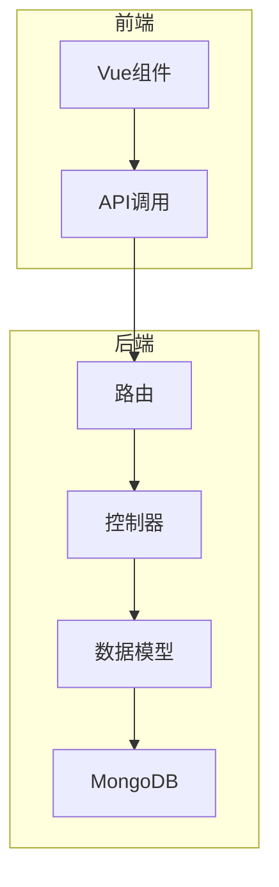
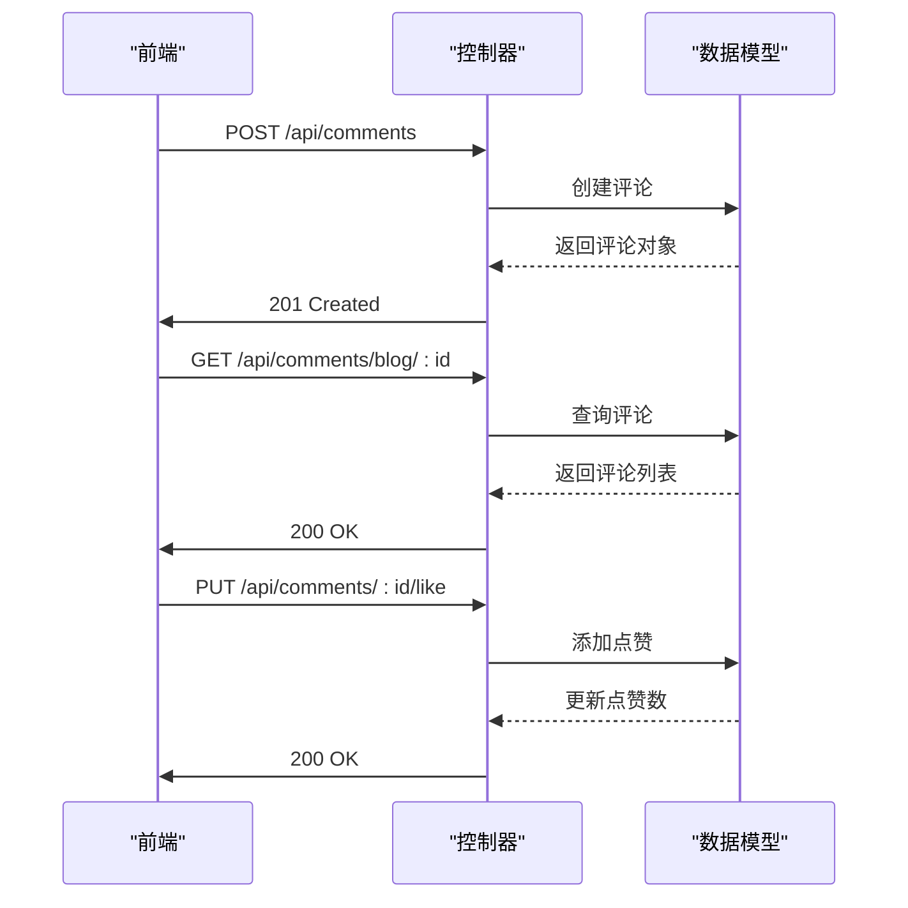
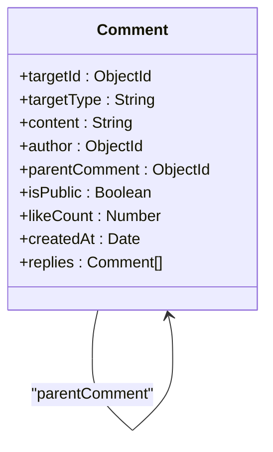
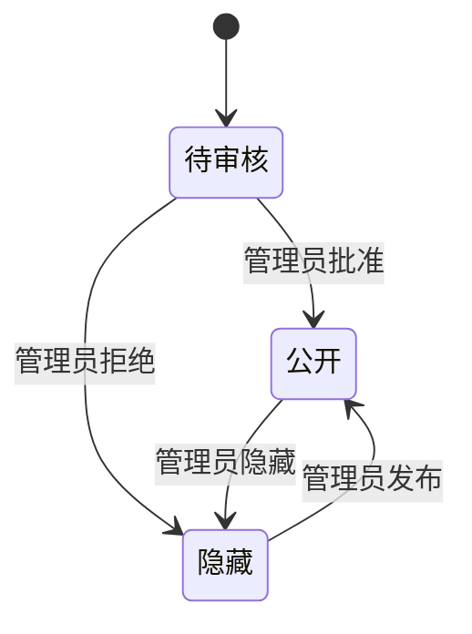
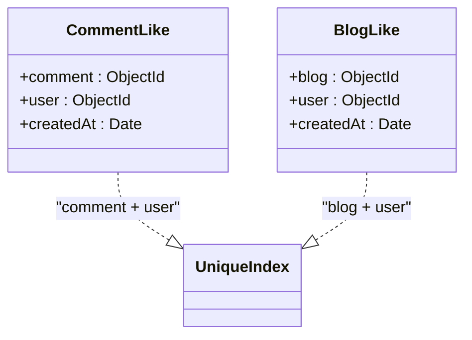
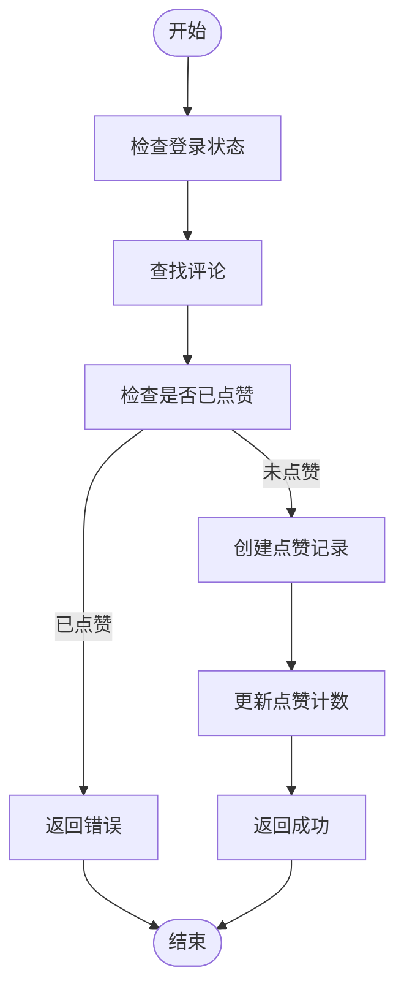
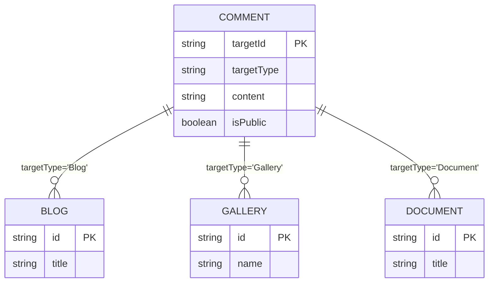
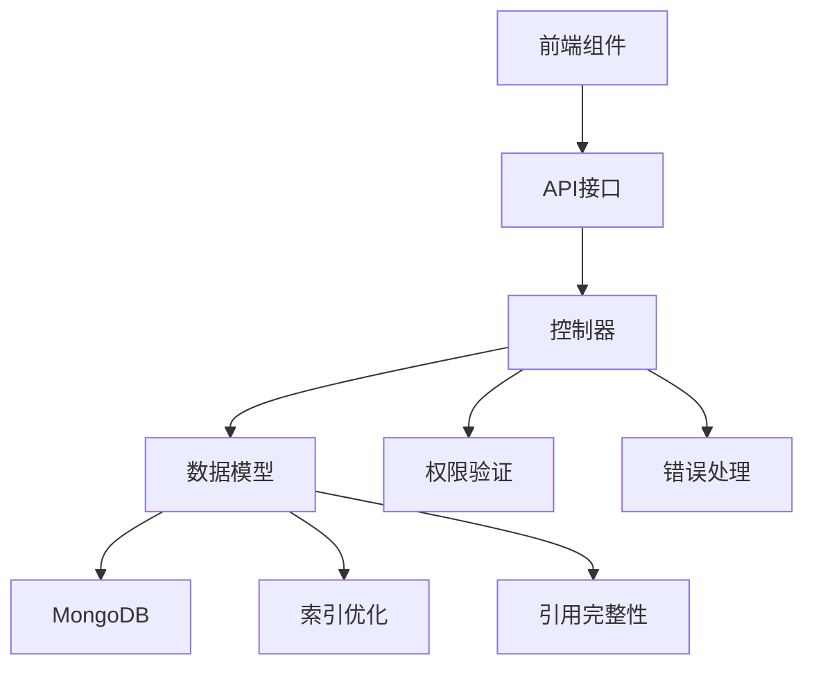

# 用户交互模型

<cite>
**本文档引用的文件**   
- [Comment.js](file://backend/models/Comment.js)
- [CommentLike.js](file://backend/models/CommentLike.js)
- [BlogLike.js](file://backend/models/BlogLike.js)
- [commentController.js](file://backend/controllers/commentController.js)
- [blogController.js](file://backend/controllers/blogController.js)
- [api.ts](file://frontend/src/types/api.ts)
</cite>

## 目录
1. [项目结构](#项目结构)
2. [核心组件](#核心组件)
3. [架构概览](#架构概览)
4. [详细组件分析](#详细组件分析)
5. [依赖关系分析](#依赖关系分析)

## 项目结构

项目采用前后端分离架构，主要分为 `backend` 和 `frontend` 两个部分。后端使用 Node.js + Express + MongoDB 技术栈，前端使用 Vue.js 框架。

- **backend/models**: 包含所有数据模型定义，如评论、点赞、博客等
- **backend/controllers**: 处理业务逻辑的核心控制器
- **backend/routes**: 定义 API 路由
- **frontend/src/api**: 前端 API 接口定义
- **frontend/src/components**: 可复用的 UI 组件，如 CommentNode.vue

该结构实现了清晰的关注点分离，便于维护和扩展。



**图示来源**
- [commentController.js](file://backend/controllers/commentController.js)
- [Comment.js](file://backend/models/Comment.js)

**本节来源**
- [backend/models/Comment.js](file://backend/models/Comment.js)
- [backend/controllers/commentController.js](file://backend/controllers/commentController.js)

## 核心组件

系统的核心交互功能围绕评论和点赞展开，主要包括：

- **Comment 模型**: 实现多级嵌套评论结构
- **CommentLike/BlogLike 模型**: 防止重复点赞
- **多态关联机制**: 支持对不同内容类型进行评论和点赞
- **内容审核状态机**: 管理评论的可见性状态

这些组件共同构成了用户交互的基础，支持博客、图库、文档等多种内容类型的互动。

**本节来源**
- [Comment.js](file://backend/models/Comment.js)
- [CommentLike.js](file://backend/models/CommentLike.js)
- [blogController.js](file://backend/controllers/blogController.js)

## 架构概览

系统采用典型的 MVC 架构模式，通过 RESTful API 进行前后端通信。用户交互行为通过 API 请求触发控制器处理，控制器调用模型进行数据操作，并返回 JSON 响应。



**图示来源**
- [commentController.js](file://backend/controllers/commentController.js)
- [blogController.js](file://backend/controllers/blogController.js)

## 详细组件分析

### 评论模型分析

#### 多级嵌套结构实现

`Comment` 模型通过 `parentComment` 字段实现多级嵌套评论结构。每个评论可以引用其父评论，形成树状结构。



**图示来源**
- [Comment.js](file://backend/models/Comment.js#L15-L80)

#### 内容审核状态机

评论的审核状态通过 `isPublic` 字段控制，实现简单的状态机：
- `isPublic: true`: 公开显示
- `isPublic: false`: 隐藏（仅作者或管理员可见）

管理员可通过 `moderateComment` 接口修改此状态，普通用户只能修改自己的评论。



**图示来源**
- [commentController.js](file://backend/controllers/commentController.js#L350-L380)

#### 敏感词过滤预处理

虽然当前代码中未直接实现敏感词过滤，但 `createComment` 方法提供了扩展点，可在保存前对 `content` 字段进行预处理：

```javascript
// 在 createComment 中可添加敏感词过滤逻辑
const commentData = {
  content: filterSensitiveWords(content.trim()), // 预处理
  // 其他字段...
}
```

**本节来源**
- [Comment.js](file://backend/models/Comment.js)
- [commentController.js](file://backend/controllers/commentController.js#L220-L250)

### 点赞模型分析

#### 防止重复点赞机制

`CommentLike` 和 `BlogLike` 模型通过复合唯一索引确保用户不能重复点赞：



**图示来源**
- [CommentLike.js](file://backend/models/CommentLike.js#L15-L30)
- [BlogLike.js](file://backend/models/BlogLike.js#L15-L30)

#### 点赞计数更新

点赞操作通过数据库事务保证原子性：



**图示来源**
- [commentController.js](file://backend/controllers/commentController.js#L390-L430)

**本节来源**
- [CommentLike.js](file://backend/models/CommentLike.js)
- [commentController.js](file://backend/controllers/commentController.js)

### 多态关联机制

系统通过 `targetType` 和 `targetId` 字段实现多态关联，支持对多种内容类型进行评论：



**图示来源**
- [Comment.js](file://backend/models/Comment.js#L30-L50)

**本节来源**
- [Comment.js](file://backend/models/Comment.js)

## 依赖关系分析

系统各组件之间存在明确的依赖关系，确保功能的完整性和一致性。



**图示来源**
- [commentController.js](file://backend/controllers/commentController.js)
- [Comment.js](file://backend/models/Comment.js)

**本节来源**
- [backend/models/Comment.js](file://backend/models/Comment.js)
- [backend/controllers/commentController.js](file://backend/controllers/commentController.js)