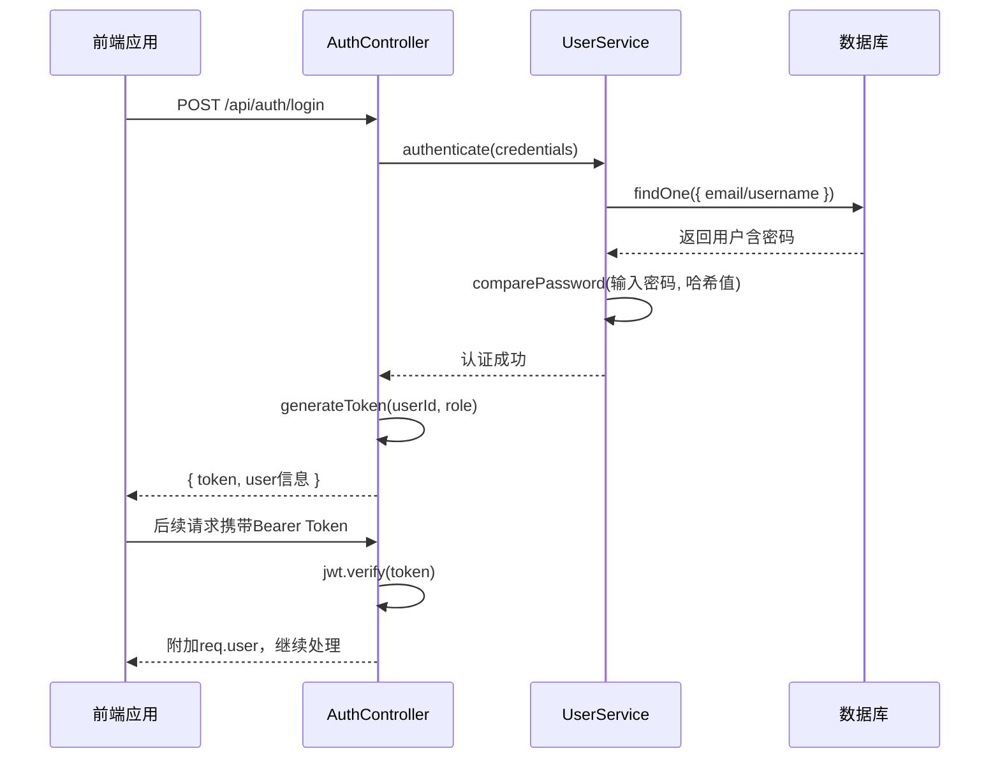
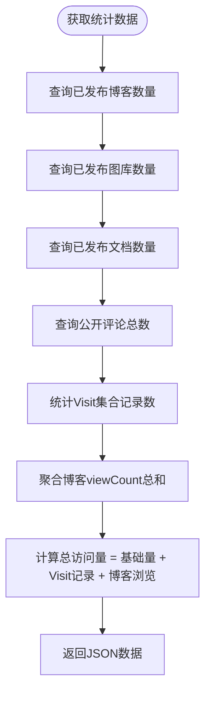

# 系统统计与用户模型

<cite>
**本文档引用文件**  
- [User.js](file://backend/models/User.js#L1-L89)
- [Visit.js](file://backend/models/Visit.js#L1-L53)
- [BlogAsset.js](file://backend/models/BlogAsset.js#L1-L38)
- [authController.js](file://backend/controllers/authController.js#L1-L140)
- [auth.js](file://backend/middleware/auth.js#L1-L65)
- [authRoutes.js](file://backend/routes/authRoutes.js#L1-L25)
- [stats.js](file://backend/routes/stats.js#L1-L138)
- [Sidebar.vue](file://frontend/src/components/Sidebar.vue#L92-L151)
- [stats.ts](file://frontend/src/api/stats.ts#L1-L65)
</cite>

## 目录
1. [系统统计与用户模型](#系统统计与用户模型)  
2. [用户数据模型详解](#用户数据模型详解)  
   - [用户名与邮箱唯一性约束](#用户名与邮箱唯一性约束)  
   - [密码加密存储机制](#密码加密存储机制)  
   - [JWT令牌与认证流程](#jwt令牌与认证流程)  
   - [角色权限控制](#角色权限控制)  
3. [访问统计模型设计](#访问统计模型设计)  
   - [页面访问记录结构](#页面访问记录结构)  
   - [聚合统计查询实现](#聚合统计查询实现)  
4. [博客资源引用管理](#博客资源引用管理)  
5. [数据安全与性能优化](#数据安全与性能优化)  
   - [敏感字段安全查询](#敏感字段安全查询)  
   - [索引策略与数据脱敏](#索引策略与数据脱敏)  

## 用户数据模型详解

本节深入分析 `User` 模型的结构、验证规则、安全机制及核心功能实现。

### 用户名与邮箱唯一性约束

`User` 模型通过数据库唯一索引确保用户名和邮箱的全局唯一性，防止重复注册。

- **用户名字段**：`username` 设置了 `unique: true` 和长度限制（3-20字符），并启用 `trim` 去除首尾空格。
- **邮箱字段**：`email` 同样设置 `unique: true`，并强制小写存储（`lowercase: true`），同时通过正则表达式验证邮箱格式。

```javascript
username: {
  type: String,
  required: [true, '用户名不能为空'],
  unique: true,
  trim: true,
  minlength: [3, '用户名至少3个字符'],
  maxlength: [20, '用户名最多20个字符']
},
email: {
  type: String,
  required: [true, '邮箱不能为空'],
  unique: true,
  trim: true,
  lowercase: true,
  match: [/^\w+([.-]?\w+)*@\w+([.-]?\w+)*(\.\w{2,3})+$/, '请输入有效的邮箱地址']
}
```

**Section sources**  
- [User.js](file://backend/models/User.js#L15-L36)

### 密码加密存储机制

密码字段采用 `bcryptjs` 库进行哈希加密，确保即使数据库泄露，原始密码也无法被轻易还原。

- **字段配置**：`password` 字段设置 `select: false`，在常规查询中自动排除，防止意外泄露。
- **Pre-save钩子**：在保存前检查密码是否被修改，若修改则生成盐值并哈希加密。

```javascript
userSchema.pre('save', async function(next) {
  if (!this.isModified('password')) return next()
  
  try {
    const salt = await bcrypt.genSalt(10)
    this.password = await bcrypt.hash(this.password, salt)
    next()
  } catch (error) {
    next(error)
  }
})
```

- **密码验证方法**：提供 `comparePassword` 实例方法，用于登录时比对用户输入密码与哈希值。

```javascript
userSchema.methods.comparePassword = async function(candidatePassword) {
  return await bcrypt.compare(candidatePassword, this.password)
}
```

**Section sources**  
- [User.js](file://backend/models/User.js#L62-L78)

### JWT令牌与认证流程

系统使用 JWT（JSON Web Token）实现无状态用户认证，包含令牌生成、验证与刷新逻辑。

#### 认证流程图



**Diagram sources**  
- [authController.js](file://backend/controllers/authController.js#L61-L140)
- [auth.js](file://backend/middleware/auth.js#L1-L37)

#### 核心实现

- **令牌生成**：`generateToken` 函数使用 `jsonwebtoken` 签发包含用户ID和角色的JWT，有效期默认7天。
- **登录处理**：`login` 方法支持邮箱或用户名登录，查找用户时使用 `.select('+password')` 显式包含密码字段。
- **认证中间件**：`auth` 中间件解析请求头中的 `Bearer` 令牌，验证后将解码的用户信息（`id`, `role`）附加到 `req.user`。

```javascript
// 生成令牌
const generateToken = (userId, userRole) => {
  return jwt.sign({ id: userId, role: userRole }, process.env.JWT_SECRET, {
    expiresIn: process.env.JWT_EXPIRES_IN || '7d'
  })
}
```

**Section sources**  
- [authController.js](file://backend/controllers/authController.js#L1-L64)
- [auth.js](file://backend/middleware/auth.js#L1-L37)

### 角色权限控制

通过 `role` 字段实现基础的角色权限控制（`user` / `admin`），并提供中间件进行路由保护。

- **字段定义**：`role` 为字符串枚举类型，默认值为 `'user'`。
- **权限检查中间件**：`checkRole` 接收允许的角色列表，验证 `req.user.role` 是否匹配。

```javascript
exports.checkRole = (...roles) => {
  return (req, res, next) => {
    if (!req.user || !roles.includes(req.user.role)) {
      return next(new ApiError(403, '没有权限执行此操作'))
    }
    next()
  }
}
```

该中间件可用于保护管理后台等敏感路由。

**Section sources**  
- [User.js](file://backend/models/User.js#L50-L55)
- [auth.js](file://backend/middleware/auth.js#L39-L65)

## 访问统计模型设计

`Visit` 模型用于记录用户访问行为，支持网站统计与数据分析。

### 页面访问记录结构

模型记录关键访问信息，用于后续分析：

- **page**：访问的页面路径（如 `/blog/123`）。
- **userAgent**：用户代理字符串，用于识别设备和浏览器。
- **ip**：访问者IP地址（可选）。
- **timestamp**：访问时间戳。
- **sessionId**：会话ID，用于去重统计。

```javascript
const visitSchema = new mongoose.Schema({
  page: { type: String, required: true, trim: true },
  userAgent: { type: String, trim: true },
  ip: { type: String, trim: true },
  timestamp: { type: Date, default: Date.now },
  sessionId: { type: String, trim: true }
}, { timestamps: true })
```

**Section sources**  
- [Visit.js](file://backend/models/Visit.js#L15-L34)

### 聚合统计查询实现

通过 `/stats` 路由提供聚合统计信息，用于前端展示。

#### 统计数据聚合流程



**Diagram sources**  
- [stats.js](file://backend/routes/stats.js#L40-L81)

#### 核心代码

```javascript
// 计算总访问量
const [totalVisits, totalBlogViews] = await Promise.all([
  Visit.countDocuments(),
  Blog.aggregate([
    { $match: { status: 'published' } },
    { $group: { _id: null, totalViews: { $sum: '$viewCount' } } }
  ])
])
const baseVisitCount = 500
const visitCount = baseVisitCount + totalVisits + (totalBlogViews[0]?.totalViews || 0)
```

前端通过 `Sidebar.vue` 调用 `statsApi.getWebsiteStats()` 获取并展示这些数据。

**Section sources**  
- [stats.js](file://backend/routes/stats.js#L1-L81)
- [Sidebar.vue](file://frontend/src/components/Sidebar.vue#L92-L151)

## 博客资源引用管理

`BlogAsset` 模型用于管理博客中嵌入的资源文件（如图片、附件）。

- **blogId**：关联的博客ID，外键引用 `Blog` 模型。
- **filename**：文件名，与 `blogId` 组成复合唯一索引，确保同一博客下文件名不重复。
- **blobUrl**：资源的存储URL。

```javascript
const blogAssetSchema = new mongoose.Schema({
  blogId: { type: mongoose.Schema.Types.ObjectId, ref: 'Blog', required: true },
  filename: { type: String, required: true, trim: true },
  title: { type: String, default: '' },
  blobUrl: { type: String, required: true }
}, { timestamps: true })

// 复合唯一索引
blogAssetSchema.index({ blogId: 1, filename: 1 }, { unique: true })
```

此设计支持资源的高效查找与去重管理。

**Section sources**  
- [BlogAsset.js](file://backend/models/BlogAsset.js#L1-L38)

## 数据安全与性能优化

### 敏感字段安全查询

为防止密码等敏感信息泄露，采取以下措施：

- **默认排除**：`password` 字段设置 `select: false`，常规查询（如 `findById`）自动排除。
- **显式包含**：仅在需要验证密码时（如登录），使用 `.select('+password')` 显式包含。

```javascript
// 登录时查找用户并包含密码
const user = await User.findOne(query).select('+password')
```

**Section sources**  
- [User.js](file://backend/models/User.js#L45)
- [authController.js](file://backend/controllers/authController.js#L75)

### 索引策略与数据脱敏

#### 索引策略

- **User模型**：`username` 和 `email` 字段的唯一索引，加速登录和注册时的查重。
- **Visit模型**：`{ page: 1, timestamp: -1 }` 和 `{ timestamp: -1 }` 索引，优化按页面和时间范围的查询性能。

```javascript
visitSchema.index({ page: 1, timestamp: -1 })
visitSchema.index({ timestamp: -1 })
```

#### 数据脱敏建议

- **IP地址**：存储前可进行部分脱敏（如保留前两段 `192.168.x.x`）。
- **UserAgent**：可提取关键信息（设备类型、浏览器）后存储，原始字符串可加密或缩短。
- **日志审计**：对包含敏感信息的操作（如登录失败）进行日志记录，便于安全审计。

**Section sources**  
- [User.js](file://backend/models/User.js#L15-L36)
- [Visit.js](file://backend/models/Visit.js#L45-L50)