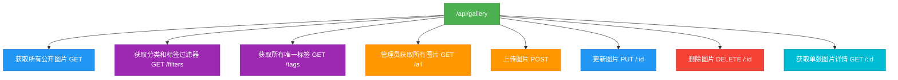
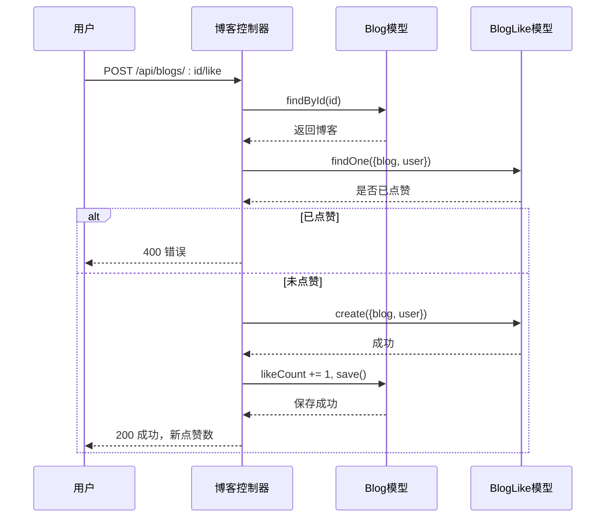

# 内容管理路由与控制器

<cite>
**本文档引用的文件**  
- [blogRoutes.js](file://backend/routes/blogRoutes.js#L1-L45)
- [document.js](file://backend/routes/document.js#L1-L49)
- [gallery.js](file://backend/routes/gallery.js#L1-L35)
- [blogController.js](file://backend/controllers/blogController.js#L1-L631)
- [documentController.js](file://backend/controllers/documentController.js)
- [galleryController.js](file://backend/controllers/galleryController.js)
- [auth.js](file://backend/middleware/auth.js)
- [upload.js](file://backend/middleware/upload.js)
- [validation.js](file://backend/middleware/validation.js)
- [Document.js](file://backend/models/Document.js)
- [Gallery.js](file://backend/models/Gallery.js)
- [Blog.js](file://backend/models/Blog.js)
</cite>

## 目录
1. [项目结构概览](#项目结构概览)  
2. [核心内容模块路由配置](#核心内容模块路由配置)  
3. [控制器逻辑与数据持久化](#控制器逻辑与数据持久化)  
4. [特色功能实现机制](#特色功能实现机制)  
5. [中间件组合模式](#中间件组合模式)  
6. [典型使用场景示例](#典型使用场景示例)  
7. [常见问题排查方案](#常见问题排查方案)

## 项目结构概览

`my_website` 项目采用前后端分离架构，后端基于 Node.js + Express 构建，前端使用 Vue 框架。整体结构清晰，按功能模块划分。

后端核心目录如下：
- `controllers`：处理业务逻辑
- `models`：定义 Mongoose 数据模型
- `routes`：配置 API 路由
- `middleware`：认证、上传、验证等通用中间件
- `utils`：工具函数（如文档转换、错误处理）

前端通过 `src/api` 调用后端 RESTful 接口，实现博客、文档库、图库三大内容模块的交互。

**Section sources**
- [project_structure](file://#L1-L100)

## 核心内容模块路由配置

### 博客模块路由（blogRoutes.js）

博客模块提供完整的 CRUD 操作和用户互动功能，路由按权限分层设计。

```mermaid
flowchart TD
A["/api/blogs"] --> B[获取博客列表 GET]
A --> C[创建博客 POST]
A --> D[更新博客 PUT]
A --> E[删除博客 DELETE]
A --> F[获取分类列表 GET /categories]
A --> G[管理员获取所有博客 GET /admin/all]
A --> H[获取博客详情 GET /:id]
A --> I[点赞 POST /:id/like]
A --> J[取消点赞 DELETE /:id/like]
A --> K[检查点赞状态 GET /:id/like-status]
style A fill:#4CAF50,stroke:#388E3C,color:white
style B fill:#2196F3,stroke:#1976D2,color:white
style C fill:#2196F3,stroke:#1976D2,color:white
style D fill:#2196F3,stroke:#1976D2,color:white
style E fill:#f44336,stroke:#d32f2f,color:white
style F fill:#9C27B0,stroke:#7B1FA2,color:white
style G fill:#FF9800,stroke:#F57C00,color:white
style H fill:#00BCD4,stroke:#0097A7,color:white
style I fill:#8BC34A,stroke:#689F38,color:white
style J fill:#8BC34A,stroke:#689F38,color:white
style K fill:#8BC34A,stroke:#689F38,color:white
```



**Diagram sources**
- [blogRoutes.js](file://backend/routes/blogRoutes.js#L1-L45)

**Section sources**
- [blogRoutes.js](file://backend/routes/blogRoutes.js#L1-L45)

### 文档库模块路由（document.js）

文档库支持多格式文档上传、预览、下载及访问统计，管理员专属操作需权限校验。


**Diagram sources**
- [document.js](file://backend/routes/document.js#L1-L49)

**Section sources**
- [document.js](file://backend/routes/document.js#L1-L49)

### 图库模块路由（gallery.js）

图库模块管理图片资源，支持分类、标签过滤，管理员可上传、更新、删除图片。



**Diagram sources**
- [gallery.js](file://backend/routes/gallery.js#L1-L35)

**Section sources**
- [gallery.js](file://backend/routes/gallery.js#L1-L35)

## 控制器逻辑与数据持久化

### 博客控制器（blogController.js）核心逻辑

博客控制器通过 Mongoose 模型 `Blog` 和 `BlogLike` 实现数据持久化，支持分页、搜索、点赞等复杂操作。

#### 获取博客列表（getBlogs）
- 支持分页（page, pageSize）
- 多条件查询：分类、标签、状态、搜索关键词
- 排序逻辑：置顶优先（pinnedPriority） + 创建时间倒序
- 并行执行查询与计数，提升性能

```javascript
const [blogs, total] = await Promise.all([
  Blog.find(query).sort(sortQuery).skip((page - 1) * pageSize).limit(pageSize),
  Blog.countDocuments(query)
]);
```

#### 创建与更新博客
- 自动设置作者（req.user.id）
- 状态为 `pinned` 时自动设置 `pinnedPriority = 1`
- 更新时检查管理员权限
- 使用 `Object.assign` 合并更新数据

#### 点赞机制
- 通过 `BlogLike` 模型记录用户点赞关系
- 防止重复点赞
- 实时更新 `likeCount` 字段



**Diagram sources**
- [blogController.js](file://backend/controllers/blogController.js#L1-L631)

**Section sources**
- [blogController.js](file://backend/controllers/blogController.js#L1-L631)

## 特色功能实现机制

### 博客标签分类处理

- 分类（category）为字符串字段，用于主分类
- 标签（tags）为字符串数组，支持多标签
- 前端通过 `/api/blogs/categories` 获取所有分类
- 搜索时支持 `$text` 索引，实现全文检索

```javascript
// 获取分类列表
exports.getCategories = async (req, res, next) => {
  const categories = await Blog.distinct('category', { 
    status: { $in: ['published', 'pinned'] } 
  });
  res.json({ success: true, data: categories.sort() });
}
```

### 文档格式转换（via documentConverter.js）

文档库支持 PPTX、DOCX 等格式转换为 HTML 预览，通过 `documentConverter.js` 调用后端服务或第三方库实现。

> 注：具体实现文件未提供，但前端组件 `PptxViewer.vue` 和 `VueOfficeViewer.vue` 表明支持 Office 文档预览。

### 图库 EXIF 信息提取

图库模块在上传图片时可提取 EXIF 信息（如拍摄时间、设备型号），存储于 `Gallery` 模型中，用于元数据展示。

> 注：具体实现文件未提供，但 `Gallery.js` 模型应包含相关字段。

### 富文本内容存储

博客和文档内容均以 HTML 字符串形式存储于 MongoDB，支持富文本编辑器输入。

### 文件上传与云存储集成

- 使用 Multer 处理文件上传
- 集成 `@vercel/blob` 实现云存储
- 上传中间件 `upload.js` 处理错误和验证

```javascript
// 示例：文档上传路由
router.post('/upload', handleUploadError, documentController.uploadDocument);
```

### 分页查询实现

所有列表接口均支持分页：
- 参数：`page`（页码）、`pageSize`（每页数量）
- 返回：`total`（总数）、`totalPages`（总页数）
- 使用 `skip` 和 `limit` 实现分页

## 中间件组合模式

### 认证中间件（auth.js）

- `auth`：强制认证，未登录返回 401
- `optionalAuth`：可选认证，未登录则 req.user = null
- `checkRole('admin')`：检查用户角色

```javascript
// 管理员专用路由
router.use(auth, checkRole('admin'));
```

### 验证中间件（validation.js）

对请求体、查询参数进行格式校验，防止非法输入。

### 上传中间件（upload.js）

- 配置 Multer 存储引擎
- 限制文件大小、MIME 类型
- 处理上传错误

```javascript
// 示例：处理上传错误
router.post('/upload', handleUploadError, documentController.uploadDocument);
```

## 典型使用场景示例

### 创建博客

**请求示例：**
```http
POST /api/blogs
Authorization: Bearer <token>
Content-Type: application/json

{
  "title": "我的第一篇博客",
  "excerpt": "这是摘要",
  "content": "<p>这是内容...</p>",
  "category": "前端开发",
  "tags": ["Vue", "JavaScript"],
  "status": "published"
}
```

**响应：**
```json
{
  "success": true,
  "data": {
    "id": "60d5ecf9f1a2c3456789abcd",
    "title": "我的第一篇博客",
    "excerpt": "这是摘要",
    "category": "前端开发",
    "tags": ["Vue", "JavaScript"],
    "status": "published",
    "date": "2023-06-15T10:00:00.000Z"
  }
}
```

### 上传 PPTX 文档

**请求示例：**
```http
POST /api/documents/upload
Authorization: Bearer <admin_token>
Content-Type: multipart/form-data

File: presentation.pptx
```

**响应：**
```json
{
  "success": true,
  "data": {
    "id": "60d5ecf9f1a2c3456789efgh",
    "filename": "presentation.pptx",
    "fileType": "pptx",
    "fileSize": 102400,
    "url": "/uploads/presentation.pptx"
  }
}
```

### 发布图片到图库

**请求示例：**
```http
POST /api/gallery
Authorization: Bearer <admin_token>
Content-Type: multipart/form-data

File: photo.jpg
category: 风景
tags: ["自然", "山水"]
```

**响应：**
```json
{
  "success": true,
  "data": {
    "id": "60d5ecf9f1a2c3456789ijkl",
    "imageUrl": "/uploads/photo.jpg",
    "thumbnailUrl": "/uploads/thumb/photo.jpg",
    "category": "风景",
    "tags": ["自然", "山水"],
    "exif": {
      "make": "Canon",
      "model": "EOS 5D Mark IV",
      "dateTime": "2023:06:15 09:30:00"
    }
  }
}
```

## 常见问题排查方案

### 内容审核流程

- 所有内容创建/更新需管理员权限
- 博客状态字段控制可见性：`draft`（草稿）、`published`（发布）、`pinned`（置顶）
- 前端管理面板提供审核界面（AdminBlogManager.vue）

### 文件大小限制

- 在 `upload.js` 中配置 Multer 的 `limits` 选项
- 示例：`limits: { fileSize: 10 * 1024 * 1024 }`（10MB）
- 超出限制时触发 `handleUploadError` 中间件

### MIME 类型校验

- 在 Multer 配置中使用 `fileFilter` 函数
- 示例：仅允许 `.pptx`, `.docx`, `.pdf` 等格式
- 非法类型返回 400 错误

```javascript
const fileFilter = (req, file, cb) => {
  const allowedTypes = ['application/vnd.openxmlformats-officedocument.presentationml.presentation', 'application/pdf'];
  if (allowedTypes.includes(file.mimetype)) {
    cb(null, true);
  } else {
    cb(new Error('不支持的文件类型'), false);
  }
};
```

### 排查步骤

1. **检查中间件顺序**：确保 `auth`、`checkRole` 等中间件正确应用
2. **验证请求头**：确认 `Authorization` 和 `Content-Type` 正确
3. **查看日志**：检查服务器错误日志
4. **测试接口**：使用 Postman 或 curl 测试 API
5. **检查模型字段**：确保请求体字段与 Mongoose 模型匹配