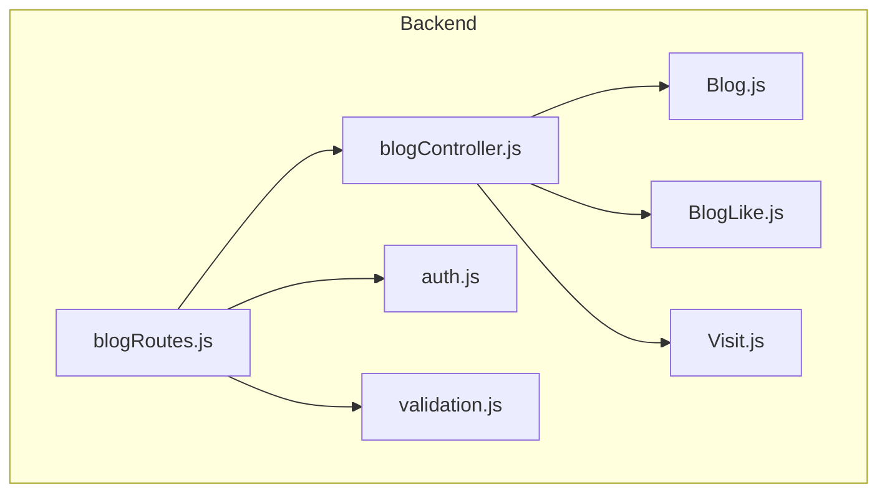
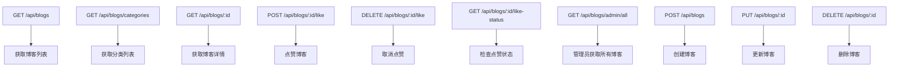
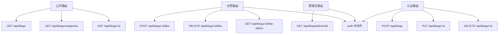
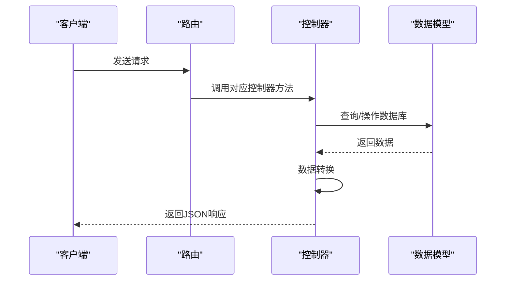
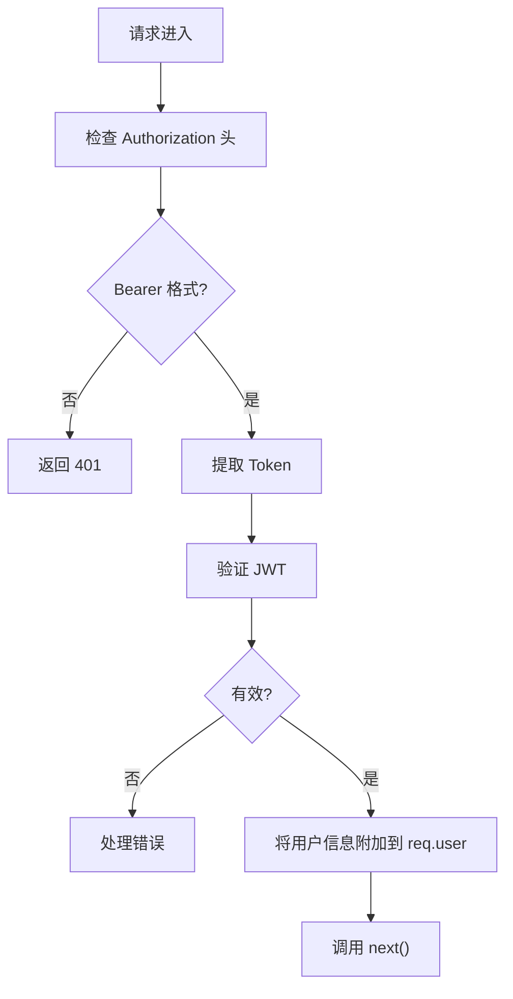
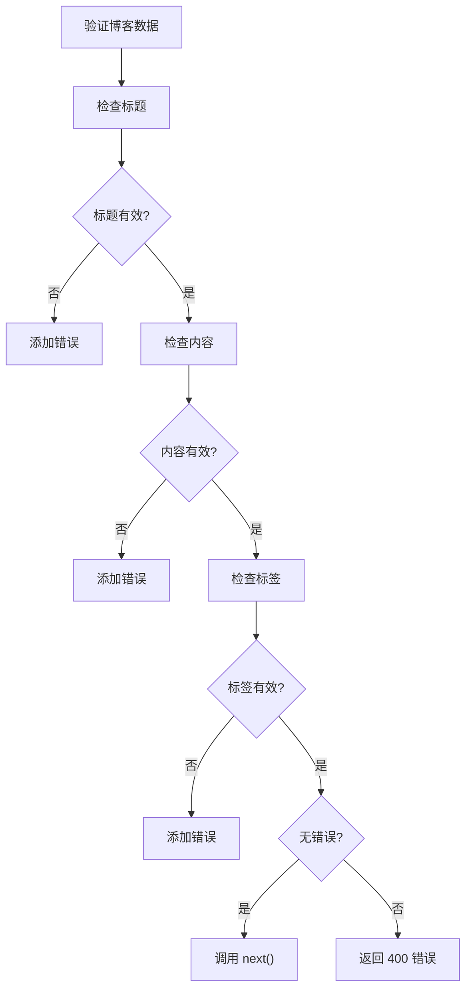
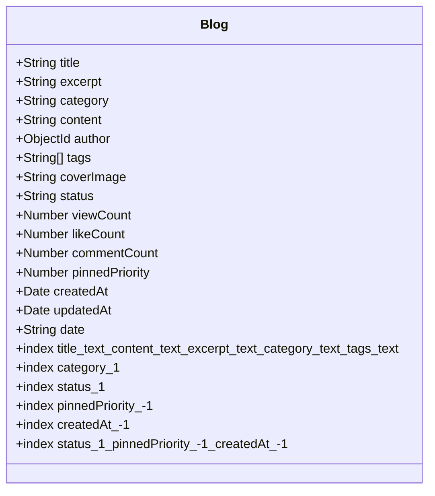
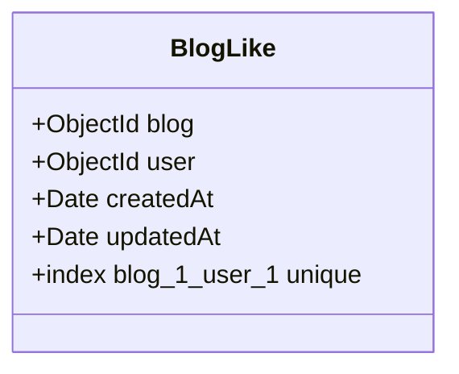
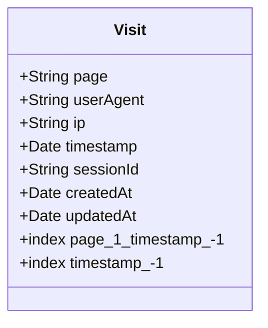

# 博客管理路由与控制器

<cite>
**本文档引用文件**  
- [blogRoutes.js](file://backend/routes/blogRoutes.js)
- [blogController.js](file://backend/controllers/blogController.js)
- [auth.js](file://backend/middleware/auth.js)
- [validation.js](file://backend/middleware/validation.js)
- [Blog.js](file://backend/models/Blog.js)
- [BlogLike.js](file://backend/models/BlogLike.js)
- [Visit.js](file://backend/models/Visit.js)
</cite>

## 目录
1. [项目结构分析](#项目结构分析)  
2. [核心组件解析](#核心组件解析)  
3. [博客路由配置](#博客路由配置)  
4. [博客控制器逻辑](#博客控制器逻辑)  
5. [权限与验证中间件](#权限与验证中间件)  
6. [数据模型设计](#数据模型设计)  
7. [关键功能实现](#关键功能实现)  
8. [常见问题与调试方案](#常见问题与调试方案)  

## 项目结构分析

项目采用前后端分离架构，后端位于 `backend` 目录，前端位于 `frontend` 目录。博客管理功能主要集中在后端的 `routes`、`controllers` 和 `models` 模块中。



**图示来源**  
- [blogRoutes.js](file://backend/routes/blogRoutes.js)
- [blogController.js](file://backend/controllers/blogController.js)
- [Blog.js](file://backend/models/Blog.js)
- [BlogLike.js](file://backend/models/BlogLike.js)
- [Visit.js](file://backend/models/Visit.js)
- [auth.js](file://backend/middleware/auth.js)
- [validation.js](file://backend/middleware/validation.js)

## 核心组件解析

博客管理功能由以下核心组件构成：

- **路由层**：`blogRoutes.js` 定义 RESTful API 端点
- **控制器层**：`blogController.js` 处理业务逻辑
- **模型层**：`Blog.js`、`BlogLike.js`、`Visit.js` 定义数据结构
- **中间件层**：`auth.js` 和 `validation.js` 提供认证与验证

这些组件共同实现了博客的增删改查、点赞、分类、搜索等完整功能。

**组件来源**  
- [blogRoutes.js](file://backend/routes/blogRoutes.js)
- [blogController.js](file://backend/controllers/blogController.js)
- [Blog.js](file://backend/models/Blog.js)
- [BlogLike.js](file://backend/models/BlogLike.js)
- [Visit.js](file://backend/models/Visit.js)

## 博客路由配置

`blogRoutes.js` 文件定义了博客模块的完整 API 路由，采用 Express 路由系统，按访问权限分层配置。

### 路由结构



### 路由权限设计



**路由来源**  
- [blogRoutes.js](file://backend/routes/blogRoutes.js#L1-L44)

## 博客控制器逻辑

`blogController.js` 实现了所有博客相关的业务逻辑，采用异步函数处理数据库操作。

### 主要函数列表

| 函数名 | 功能描述 |
|-------|--------|
| `getBlogs` | 获取博客列表（支持分页、分类、标签、搜索） |
| `getBlogById` | 获取博客详情（自动增加浏览量） |
| `createBlog` | 创建博客（自动设置作者和状态） |
| `updateBlog` | 更新博客（仅管理员可操作） |
| `deleteBlog` | 删除博客（仅管理员可操作） |
| `likeBlog` | 点赞博客（防止重复点赞） |
| `unlikeBlog` | 取消点赞 |
| `checkBlogLikeStatus` | 检查用户点赞状态（可选认证） |
| `getCategories` | 获取所有分类 |
| `getAllBlogsForAdmin` | 管理员获取所有博客（含草稿） |
| `searchBlogs` | 全文搜索博客 |

### 请求处理流程



**控制器来源**  
- [blogController.js](file://backend/controllers/blogController.js#L1-L630)

## 权限与验证中间件

系统通过中间件实现权限控制和数据验证。

### 认证中间件 (auth.js)



### 验证中间件 (validation.js)

`validateBlog` 函数验证博客数据：



**中间件来源**  
- [auth.js](file://backend/middleware/auth.js#L1-L66)
- [validation.js](file://backend/middleware/validation.js#L1-L298)

## 数据模型设计

### 博客模型 (Blog.js)



### 博客点赞模型 (BlogLike.js)



### 访问统计模型 (Visit.js)



**数据模型来源**  
- [Blog.js](file://backend/models/Blog.js#L1-L130)
- [BlogLike.js](file://backend/models/BlogLike.js#L1-L31)
- [Visit.js](file://backend/models/Visit.js#L1-L53)

## 关键功能实现

### 分页查询实现

```javascript
// 分页参数解析
const page = parseInt(req.query.page) || 1
const pageSize = parseInt(req.query.pageSize) || 10

// 并行执行查询和计数
const [blogs, total] = await Promise.all([
  Blog.find(query)
    .sort(sortQuery)
    .skip((page - 1) * pageSize)
    .limit(pageSize),
  Blog.countDocuments(query)
])
```

### 点赞功能实现

```javascript
// 检查是否已点赞
const existingLike = await BlogLike.findOne({
  blog: id,
  user: req.user.id
})

if (existingLike) {
  throw new ApiError(400, '您已经点赞过这篇博客')
}

// 创建点赞记录
await BlogLike.create({ blog: id, user: req.user.id })

// 更新点赞数
blog.likeCount += 1
await blog.save()
```

### 搜索功能实现

```javascript
// 使用文本索引搜索
const query = {
  status: 'published',
  $text: { $search: searchTerm }
}

// 按相关性排序
Blog.find(query, { score: { $meta: 'textScore' } })
  .sort({ score: { $meta: 'textScore' }, createdAt: -1 })
```

**功能实现来源**  
- [blogController.js](file://backend/controllers/blogController.js#L1-L630)
- [Blog.js](file://backend/models/Blog.js#L1-L130)

## 常见问题与调试方案

### 内容保存失败

**可能原因**：
- 标题或内容为空
- 标题超过100字符
- 内容超过50000字符

**调试方案**：
1. 检查请求体是否包含 `title` 和 `content`
2. 验证字段长度是否符合要求
3. 查看服务器日志中的验证错误信息

### 标签注入问题

**可能原因**：
- 标签字段未正确验证
- 标签数组包含非字符串类型

**解决方案**：
```javascript
// 在 validateBlog 中添加标签验证
if (tag && typeof tag !== 'string') {
  errors.push('标签必须是字符串类型')
} else if (tag && tag.length > 20) {
  errors.push('标签不能超过20个字符')
}
```

### 权限拒绝

**可能原因**：
- 用户未登录（缺少 Bearer Token）
- 用户角色不是管理员
- 路由顺序错误导致中间件未正确应用

**调试方案**：
1. 确认请求头包含 `Authorization: Bearer <token>`
2. 检查用户角色是否为 `admin`
3. 确保 `auth` 中间件在需要认证的路由前应用

**问题调试来源**  
- [validation.js](file://backend/middleware/validation.js#L1-L298)
- [auth.js](file://backend/middleware/auth.js#L1-L66)
- [blogController.js](file://backend/controllers/blogController.js#L1-L630)