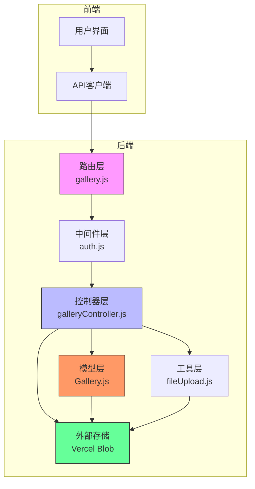
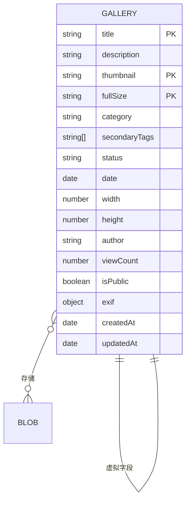
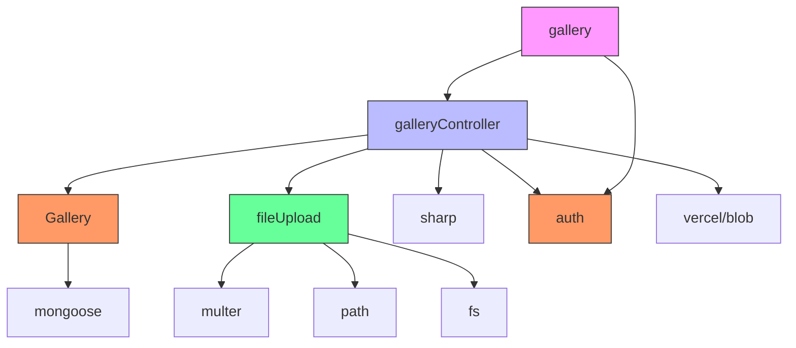

# 图库管理路由与控制器

<cite>
**本文档引用的文件**  
- [gallery.js](file://backend/routes/gallery.js#L1-L34)
- [galleryController.js](file://backend/controllers/galleryController.js#L1-L218)
- [Gallery.js](file://backend/models/Gallery.js#L1-L120)
- [fileUpload.js](file://backend/utils/fileUpload.js#L1-L139)
- [auth.js](file://backend/middleware/auth.js#L1-L67)
</cite>

## 目录
1. [引言](#引言)
2. [项目结构](#项目结构)
3. [核心组件](#核心组件)
4. [架构概览](#架构概览)
5. [详细组件分析](#详细组件分析)
6. [依赖分析](#依赖分析)
7. [性能考虑](#性能考虑)
8. [故障排除指南](#故障排除指南)
9. [结论](#结论)

## 引言
本文档详细解析 my_website 项目中图库管理功能的实现机制，重点分析其路由配置、控制器逻辑、文件上传处理、图像处理流程、数据模型设计及权限控制策略。通过深入剖析 `gallery.js` 路由、`galleryController.js` 控制器、`Gallery.js` 数据模型以及 `fileUpload.js` 工具模块，全面揭示图库功能的技术架构与工作流程。文档涵盖图片上传、分类查询、分页列表、删除操作等核心功能，并提供针对常见问题的解决方案与最佳实践。

## 项目结构
图库管理功能的代码分布在后端（backend）目录下的多个子模块中，遵循典型的 MVC（模型-视图-控制器）架构模式。核心文件包括：
- **路由层** (`backend/routes/gallery.js`): 定义所有图库相关的 API 端点。
- **控制器层** (`backend/controllers/galleryController.js`): 实现业务逻辑，处理请求和响应。
- **模型层** (`backend/models/Gallery.js`): 定义图库数据的结构、验证规则和数据库操作。
- **工具层** (`backend/utils/fileUpload.js`): 提供文件上传的通用配置和辅助函数。
- **中间件层** (`backend/middleware/auth.js`): 提供身份验证和角色权限检查功能。

**Section sources**
- [gallery.js](file://backend/routes/gallery.js#L1-L34)
- [galleryController.js](file://backend/controllers/galleryController.js#L1-L218)
- [Gallery.js](file://backend/models/Gallery.js#L1-L120)

## 核心组件
图库管理的核心组件包括路由配置、控制器逻辑、数据模型和文件上传工具。这些组件协同工作，实现了图片的上传、存储、查询、更新和删除等完整生命周期管理。

**Section sources**
- [gallery.js](file://backend/routes/gallery.js#L1-L34)
- [galleryController.js](file://backend/controllers/galleryController.js#L1-L218)
- [Gallery.js](file://backend/models/Gallery.js#L1-L120)
- [fileUpload.js](file://backend/utils/fileUpload.js#L1-L139)

## 架构概览
图库管理功能的架构遵循清晰的分层设计，各组件职责分明，通过标准的 HTTP 请求进行交互。



**Diagram sources**
- [gallery.js](file://backend/routes/gallery.js#L1-L34)
- [galleryController.js](file://backend/controllers/galleryController.js#L1-L218)
- [Gallery.js](file://backend/models/Gallery.js#L1-L120)
- [fileUpload.js](file://backend/utils/fileUpload.js#L1-L139)

## 详细组件分析

### 路由配置分析
`gallery.js` 文件定义了图库功能的所有 API 端点，明确区分了公开路由和管理员专用路由，并通过中间件实现了访问控制。

#### 路由端点与权限控制
```mermaid
flowchart TD
A[HTTP请求] --> B{请求路径}
B --> |/api/gallery| C[公开路由]
B --> |/api/gallery/all| D[管理员路由]
B --> |/api/gallery| E[管理员路由]
B --> |/api/gallery/:id| F[管理员路由]
B --> |/api/gallery/:id| G[公开路由]
C --> H[getImages]
D --> I[getAllImages]
E --> J[uploadImage]
F --> K[updateImage]
F --> L[deleteImage]
G --> M[getImage]
I --> Auth[auth]
I --> Role[checkRole('admin')]
J --> Auth
J --> Role
K --> Auth
K --> Role
L --> Auth
L --> Role
style C fill:#cfc,stroke:#333
style D fill:#fcc,stroke:#333
style E fill:#fcc,stroke:#333
style F fill:#fcc,stroke:#333
style G fill:#cfc,stroke:#333
style H fill:#cfc,stroke:#333
style I fill:#fcc,stroke:#333
style J fill:#fcc,stroke:#333
style K fill:#fcc,stroke:#333
style L fill:#fcc,stroke:#333
style M fill:#cfc,stroke:#333
style Auth fill:#f96,stroke:#333
style Role fill:#f96,stroke:#333
```

**Diagram sources**
- [gallery.js](file://backend/routes/gallery.js#L1-L34)

**Section sources**
- [gallery.js](file://backend/routes/gallery.js#L1-L34)

### 控制器逻辑分析
`galleryController.js` 是图库功能的核心，包含了所有业务逻辑的实现。

#### 图片上传流程
该流程详细描述了 `uploadImage` 函数处理图片上传的完整步骤，包括文件处理、图像转换、外部存储和数据库持久化。

```mermaid
sequenceDiagram
participant Client as "客户端"
participant Router as "路由"
participant Controller as "控制器"
participant Sharp as "Sharp"
participant Blob as "Vercel Blob"
participant DB as "数据库"
Client->>Router : POST /api/gallery
Router->>Controller : 调用 uploadImage
Controller->>Controller : imageUpload.single('image')
Controller->>Controller : Multer处理文件
alt 处理失败
Controller-->>Client : 400 错误
return
end
Controller->>Sharp : sharp(fileBuffer).metadata()
Sharp-->>Controller : imageInfo (宽, 高)
Controller->>Blob : put(原图, buffer)
Blob-->>Controller : fullSizeBlob.url
Controller->>Sharp : sharp(fileBuffer).resize(400).toBuffer()
Sharp-->>Controller : thumbnailBuffer
Controller->>Blob : put(缩略图, thumbnailBuffer)
Blob-->>Controller : thumbnailBlob.url
Controller->>DB : Gallery.create(数据)
DB-->>Controller : newImage
Controller-->>Client : 201 成功
Note over Controller,Blob : 使用Vercel Blob存储<br/>实现无服务器持久化
```

**Diagram sources**
- [galleryController.js](file://backend/controllers/galleryController.js#L97-L159)
- [fileUpload.js](file://backend/utils/fileUpload.js#L1-L139)

**Section sources**
- [galleryController.js](file://backend/controllers/galleryController.js#L97-L159)

#### 图片删除流程
该流程描述了 `deleteImage` 函数如何安全地删除图片，包括从外部存储和数据库中移除记录。

```mermaid
sequenceDiagram
participant Client as "客户端"
participant Router as "路由"
participant Controller as "控制器"
participant Blob as "Vercel Blob"
participant DB as "数据库"
Client->>Router : DELETE /api/gallery/ : id
Router->>Controller : 调用 deleteImage
Controller->>DB : Gallery.findById(id)
alt 图片不存在
Controller-->>Client : 404 错误
return
end
DB-->>Controller : image
try
Controller->>Blob : del(image.fullSize)
Controller->>Blob : del(image.thumbnail)
catch
Controller->>Console : 记录删除失败日志
end
Controller->>DB : Gallery.findByIdAndDelete(id)
DB-->>Controller : 删除确认
Controller-->>Client : 200 成功
Note over Controller,Blob : 删除失败不会阻止<br/>数据库记录的删除
```

**Diagram sources**
- [galleryController.js](file://backend/controllers/galleryController.js#L161-L201)

**Section sources**
- [galleryController.js](file://backend/controllers/galleryController.js#L161-L201)

### 数据模型分析
`Gallery.js` 定义了图库数据的结构和约束，是数据持久化的基础。

#### 图库数据模型


**Diagram sources**
- [Gallery.js](file://backend/models/Gallery.js#L1-L120)

**Section sources**
- [Gallery.js](file://backend/models/Gallery.js#L1-L120)

### 文件上传工具分析
`fileUpload.js` 提供了统一的文件上传配置，确保了上传过程的安全性和一致性。

#### 图片上传配置
```mermaid
classDiagram
class createUpload {
+uploadPath : String
+allowedTypes : RegExp
+maxSize : Number
+storage : multer.memoryStorage()
+limits : Object
+fileFilter : Function
+createUpload(uploadPath, allowedTypes, maxSize) : multer.Multer
}
class imageUpload {
+uploadPath : 'uploads/gallery/'
+allowedTypes : /jpeg|jpg|png|gif|webp/
+maxSize : 10 * 1024 * 1024
}
createUpload <|-- imageUpload
imageUpload : "const imageUpload = createUpload(...)"
note right of createUpload
使用内存存储，配合Vercel Blob
解决无服务器环境的文件持久化问题
end note
```

**Diagram sources**
- [fileUpload.js](file://backend/utils/fileUpload.js#L1-L139)

**Section sources**
- [fileUpload.js](file://backend/utils/fileUpload.js#L1-L139)

## 依赖分析
图库管理功能依赖于多个内部和外部模块，形成了一个紧密协作的系统。



**Diagram sources**
- [gallery.js](file://backend/routes/gallery.js#L1-L34)
- [galleryController.js](file://backend/controllers/galleryController.js#L1-L218)
- [Gallery.js](file://backend/models/Gallery.js#L1-L120)
- [fileUpload.js](file://backend/utils/fileUpload.js#L1-L139)
- [auth.js](file://backend/middleware/auth.js#L1-L67)

**Section sources**
- [gallery.js](file://backend/routes/gallery.js#L1-L34)
- [galleryController.js](file://backend/controllers/galleryController.js#L1-L218)
- [Gallery.js](file://backend/models/Gallery.js#L1-L120)
- [fileUpload.js](file://backend/utils/fileUpload.js#L1-L139)
- [auth.js](file://backend/middleware/auth.js#L1-L67)

## 性能考虑
图库功能在设计上考虑了性能优化，主要体现在以下几个方面：

1.  **数据库索引**：`Gallery` 模型在 `category`、`secondaryTags` 和 `date` 字段上建立了复合索引，在 `title` 和 `description` 上建立了文本索引，极大地提升了查询效率。
2.  **分页查询**：`getImages` 接口实现了分页机制，通过 `limit` 和 `skip` 参数避免一次性加载过多数据，减轻了服务器和数据库的压力。
3.  **缓存友好**：使用 Vercel Blob 存储图片，其 CDN 特性可以有效缓存静态资源，减少服务器带宽消耗和用户访问延迟。
4.  **异步处理**：所有数据库和文件操作均使用 `async/await`，避免了阻塞主线程，提高了并发处理能力。

## 故障排除指南

### 常见问题与解决方案

**问题：大图上传失败**
- **原因**：文件大小超过 Multer 限制（10MB）或 Vercel Blob 限制。
- **解决方案**：
  1. 检查 `fileUpload.js` 中 `imageUpload` 的 `maxSize` 配置。
  2. 在上传前使用前端工具（如浏览器内置的图片压缩）预处理图片。
  3. 考虑调整 `maxSize` 限制，但需评估服务器和存储成本。

**问题：EXIF 信息解析异常**
- **原因**：当前代码未集成 EXIF 解析库（如 `exifr` 或 `piexifjs`），`exif` 字段为空。
- **解决方案**：
  1. 安装 EXIF 解析库：`npm install exifr`。
  2. 在 `uploadImage` 函数中，于 `sharp` 处理后添加 EXIF 读取逻辑：
     ```javascript
     const exifData = await exifr.parse(fileBuffer);
     // 将 exifData 映射到 newImage 的 exif 字段
     ```

**问题：存储配额超限**
- **原因**：Vercel Blob 的免费额度已用完。
- **解决方案**：
  1. 监控 Vercel 仪表板中的 Blob 使用情况。
  2. 清理不再需要的旧图片。
  3. 升级到付费计划以获得更大配额。
  4. 考虑集成其他云存储服务（如 AWS S3, Cloudinary）作为备选方案。

### 最佳实践
1.  **前端预处理**：在上传前对图片进行压缩和尺寸调整，可以显著减少上传时间和存储成本。
2.  **错误日志**：确保 `console.error` 日志被正确收集和监控，以便快速发现和解决问题。
3.  **安全验证**：除了后端验证，前端也应进行基本的文件类型和大小检查，提升用户体验。
4.  **定期维护**：建立定期清理未使用图片的机制，防止存储空间无限增长。

**Section sources**
- [galleryController.js](file://backend/controllers/galleryController.js#L97-L159)
- [fileUpload.js](file://backend/utils/fileUpload.js#L1-L139)

## 结论
my_website 项目的图库管理功能通过清晰的分层架构和现代化的技术栈（Express, Mongoose, Sharp, Vercel Blob）实现了高效、安全的图片管理。其设计充分利用了无服务器架构的优势，通过 Vercel Blob 解决了文件持久化问题，并通过 Multer 和 Sharp 实现了强大的文件处理能力。尽管当前实现缺少 EXIF 信息的自动提取，但其模块化的设计使得功能扩展非常方便。通过遵循本文档提供的最佳实践，可以有效应对大图上传、存储配额等挑战，确保图库功能的稳定和高效运行。