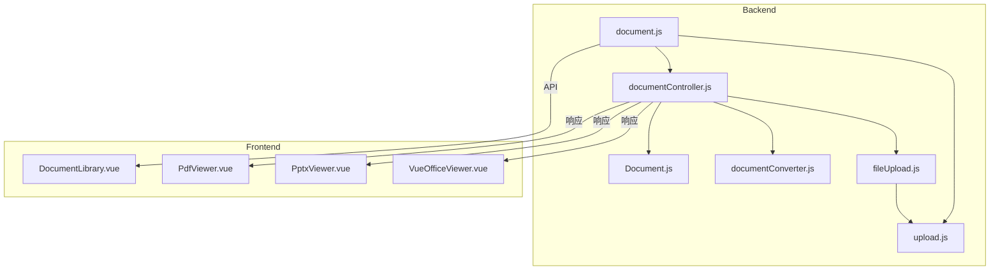
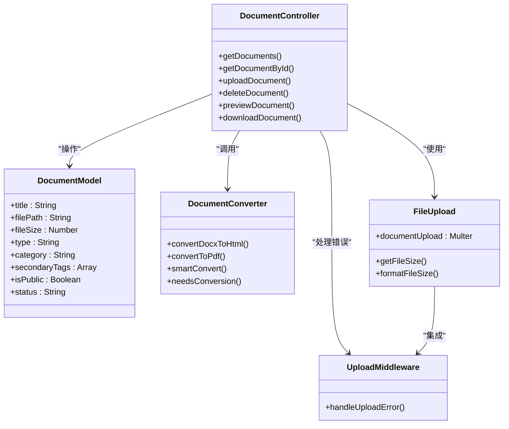
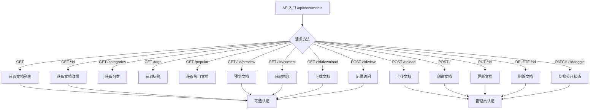
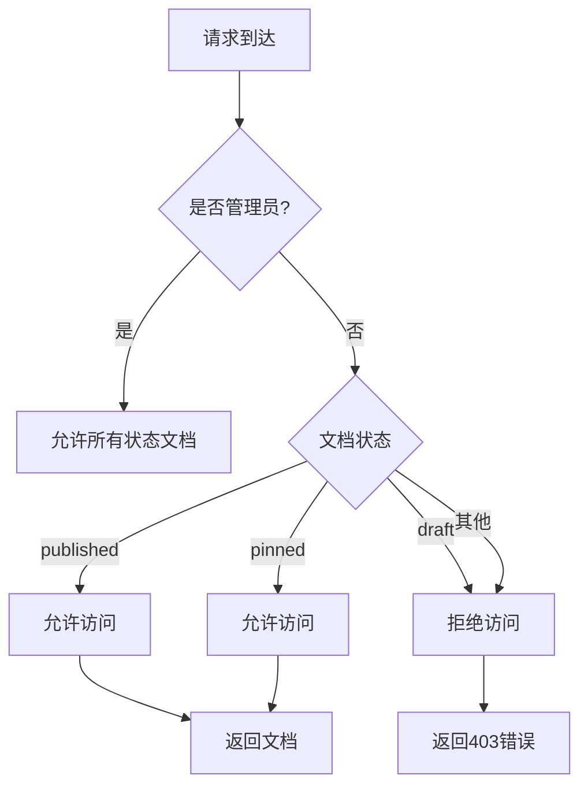
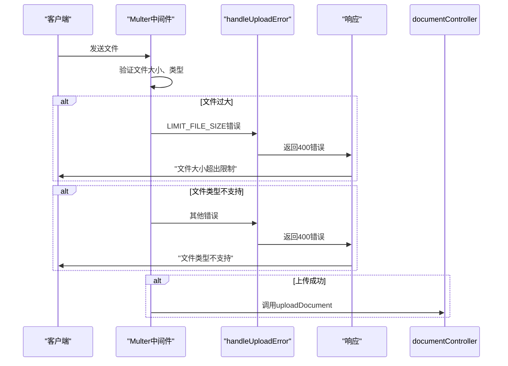
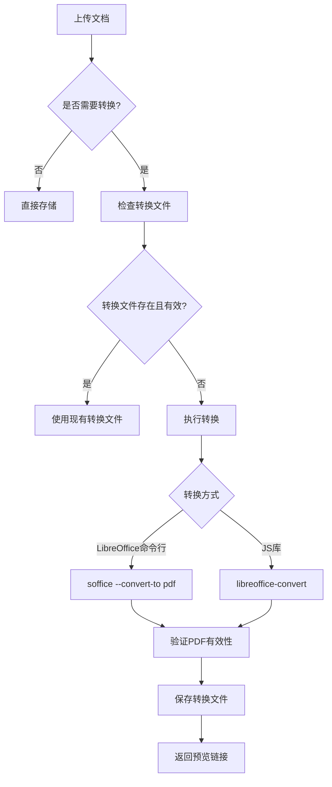
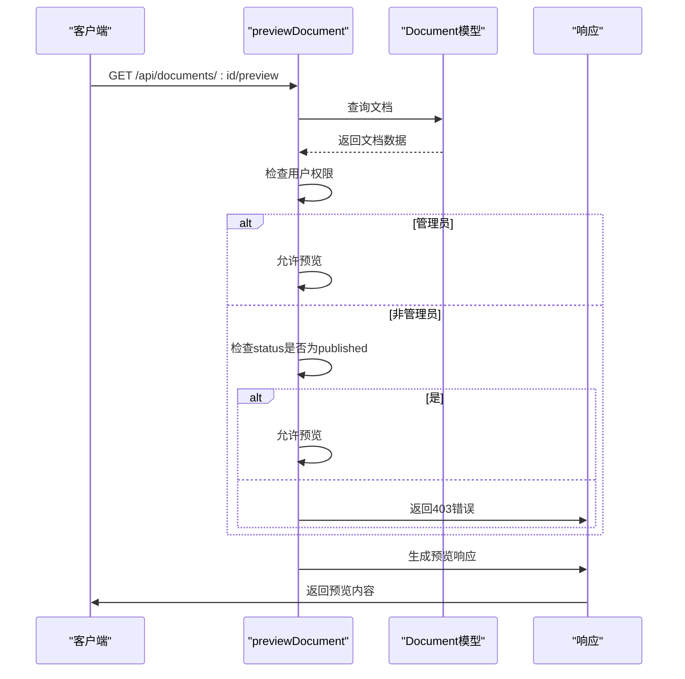

# 文档库管理路由与控制器

<cite>
**本文档引用的文件**   
- [document.js](file://backend/routes/document.js#L1-L48)
- [documentController.js](file://backend/controllers/documentController.js#L1-L799)
- [documentConverter.js](file://backend/utils/documentConverter.js#L1-L291)
- [upload.js](file://backend/middleware/upload.js#L1-L29)
- [fileUpload.js](file://backend/utils/fileUpload.js#L1-L138)
- [Document.js](file://backend/models/Document.js#L1-L152)
</cite>

## 目录
1. [项目结构分析](#项目结构分析)
2. [核心组件分析](#核心组件分析)
3. [文档上传与路由机制](#文档上传与路由机制)
4. [文档控制器逻辑详解](#文档控制器逻辑详解)
5. [文件上传与中间件集成](#文件上传与中间件集成)
6. [多格式文档处理与转换](#多格式文档处理与转换)
7. [文档预览与安全控制](#文档预览与安全控制)
8. [异步处理与错误回滚](#异步处理与错误回滚)
9. [请求示例与问题排查](#请求示例与问题排查)
10. [性能优化建议](#性能优化建议)

## 项目结构分析

项目采用前后端分离架构，后端位于 `backend` 目录，前端位于 `frontend` 目录。文档管理功能主要集中在后端的路由、控制器、模型和工具模块中。



**图示来源**
- [document.js](file://backend/routes/document.js#L1-L48)
- [documentController.js](file://backend/controllers/documentController.js#L1-L799)
- [Document.js](file://backend/models/Document.js#L1-L152)

**本节来源**
- [document.js](file://backend/routes/document.js#L1-L48)
- [documentController.js](file://backend/controllers/documentController.js#L1-L799)

## 核心组件分析

文档管理模块由多个核心组件构成，各司其职，协同工作。

### 组件关系图



**图示来源**
- [documentController.js](file://backend/controllers/documentController.js#L1-L799)
- [Document.js](file://backend/models/Document.js#L1-L152)
- [documentConverter.js](file://backend/utils/documentConverter.js#L1-L291)
- [fileUpload.js](file://backend/utils/fileUpload.js#L1-L138)
- [upload.js](file://backend/middleware/upload.js#L1-L29)

**本节来源**
- [documentController.js](file://backend/controllers/documentController.js#L1-L799)
- [Document.js](file://backend/models/Document.js#L1-L152)

## 文档上传与路由机制

文档路由模块 `document.js` 定义了完整的API接口体系，采用Express路由系统，区分公开访问与管理员专用接口。

### 路由设计结构



**图示来源**
- [document.js](file://backend/routes/document.js#L1-L48)

**本节来源**
- [document.js](file://backend/routes/document.js#L1-L48)

## 文档控制器逻辑详解

`documentController.js` 是文档管理的核心逻辑处理模块，实现了所有文档操作的业务逻辑。

### 主要功能函数

- **getDocuments**: 获取文档列表，支持分页、分类、搜索过滤
- **getDocumentById**: 获取单个文档详情，更新下载次数
- **uploadDocument**: 处理文件上传，存储至Vercel Blob
- **deleteDocument**: 删除文档，清理Blob存储
- **previewDocument**: 生成文档预览，支持多格式
- **downloadDocument**: 下载文档，记录下载次数

### 权限控制逻辑



**图示来源**
- [documentController.js](file://backend/controllers/documentController.js#L1-L799)

**本节来源**
- [documentController.js](file://backend/controllers/documentController.js#L1-L799)

## 文件上传与中间件集成

文件上传功能通过Multer中间件实现，与Vercel Blob存储系统深度集成。

### 上传配置分析

```javascript
// 文档上传配置
const documentUpload = createUpload(
  'uploads/documents/',
  /pdf|doc|docx|ppt|pptx|xls|xlsx|txt|md/,
  50 * 1024 * 1024 // 50MB
)
```

### 上传错误处理



**图示来源**
- [fileUpload.js](file://backend/utils/fileUpload.js#L1-L138)
- [upload.js](file://backend/middleware/upload.js#L1-L29)

**本节来源**
- [fileUpload.js](file://backend/utils/fileUpload.js#L1-L138)
- [upload.js](file://backend/middleware/upload.js#L1-L29)

## 多格式文档处理与转换

系统通过 `documentConverter.js` 模块实现多格式文档的智能转换与预览支持。

### 文档转换流程



### 转换支持格式

- **输入格式**: DOCX, PPTX, XLSX, DOC, PPT, XLS
- **输出格式**: PDF, HTML
- **特殊处理**: TXT, MD 直接预览；PDF 直接提供

**图示来源**
- [documentConverter.js](file://backend/utils/documentConverter.js#L1-L291)

**本节来源**
- [documentConverter.js](file://backend/utils/documentConverter.js#L1-L291)

## 文档预览与安全控制

文档预览功能通过JWT认证和权限检查确保安全性，支持多种预览方案。

### 预览安全机制



### PPTX预览方案

系统为PPTX文件提供多种预览方案：

1. **Office Online**: `https://view.officeapps.live.com/op/embed.aspx?src=文件URL`
2. **Google Docs**: `https://docs.google.com/gview?url=文件URL&embedded=true`
3. **本地下载**: 提供下载链接

**图示来源**
- [documentController.js](file://backend/controllers/documentController.js#L1-L799)

**本节来源**
- [documentController.js](file://backend/controllers/documentController.js#L1-L799)

## 异步处理与错误回滚

系统采用异步处理机制，确保操作的原子性和数据一致性。

### 删除操作的错误处理

```javascript
// 删除文档时的错误处理
try {
    // 尝试删除Blob文件
    await del(document.filePath);
} catch (err) {
    // 记录错误但不阻止数据库删除
    console.error('从Vercel Blob删除文件失败:', err);
}
// 继续删除数据库记录
await Document.findByIdAndDelete(req.params.id);
```

### 上传回滚策略

- **文件上传失败**: Multer自动清理临时文件
- **数据库保存失败**: 已上传的Blob文件需要手动清理或通过定时任务处理
- **转换失败**: 保留原始文件，标记为转换失败状态

**本节来源**
- [documentController.js](file://backend/controllers/documentController.js#L1-L799)

## 请求示例与问题排查

### PPTX上传与预览完整流程

**上传请求**
```http
POST /api/documents/upload
Authorization: Bearer <JWT_TOKEN>
Content-Type: multipart/form-data

文件: presentation.pptx
元数据: {
  "title": "年度报告",
  "category": "报告",
  "tags": ["年度", "总结"]
}
```

**预览响应**
```html
<!DOCTYPE html>
<html>
<head>
    <title>年度报告 - PowerPoint预览</title>
</head>
<body>
    <div class="preview-options">
        <button onclick="previewWithOfficeOnline()">Office Online预览</button>
        <button onclick="previewWithGoogleDocs()">Google Docs预览</button>
        <a href="/api/documents/123/download">下载文档</a>
    </div>
</body>
</html>
```

### 常见问题排查指南

| 问题 | 可能原因 | 解决方案 |
|------|---------|---------|
| 上传失败 | 文件过大 | 检查是否超过50MB限制 |
| 上传失败 | 文件类型不支持 | 确认文件扩展名为支持的格式 |
| 预览失败 | PPTX转换失败 | 检查LibreOffice服务是否正常 |
| 下载失败 | 文件路径错误 | 检查Vercel Blob配置 |
| 超时 | 转换耗时过长 | 增加超时时间或优化转换流程 |

**本节来源**
- [documentController.js](file://backend/controllers/documentController.js#L1-L799)
- [documentConverter.js](file://backend/utils/documentConverter.js#L1-L291)

## 性能优化建议

### 1. 文件存储优化

- **使用Vercel Blob**: 确保配置 `BLOB_READ_WRITE_TOKEN` 环境变量
- **CDN加速**: 利用Vercel全球CDN网络加速文件访问

### 2. 转换性能优化

- **缓存机制**: `smartConvert` 方法已实现文件缓存，避免重复转换
- **异步转换**: 考虑将转换操作放入后台任务队列
- **资源监控**: 监控LibreOffice进程资源使用情况

### 3. 数据库查询优化

- **索引优化**: 已为 `category`、`type`、`date` 字段创建索引
- **分页查询**: 使用 `limit` 和 `skip` 实现高效分页
- **聚合查询**: 使用MongoDB聚合管道优化统计查询

### 4. 错误处理优化

- **超时处理**: 转换操作设置30秒超时
- **降级策略**: 当LibreOffice失败时，尝试JS库作为备选方案
- **日志记录**: 详细记录转换过程中的关键步骤

**本节来源**
- [documentConverter.js](file://backend/utils/documentConverter.js#L1-L291)
- [Document.js](file://backend/models/Document.js#L1-L152)