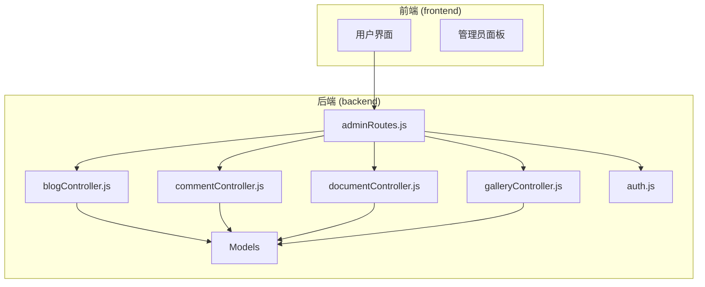
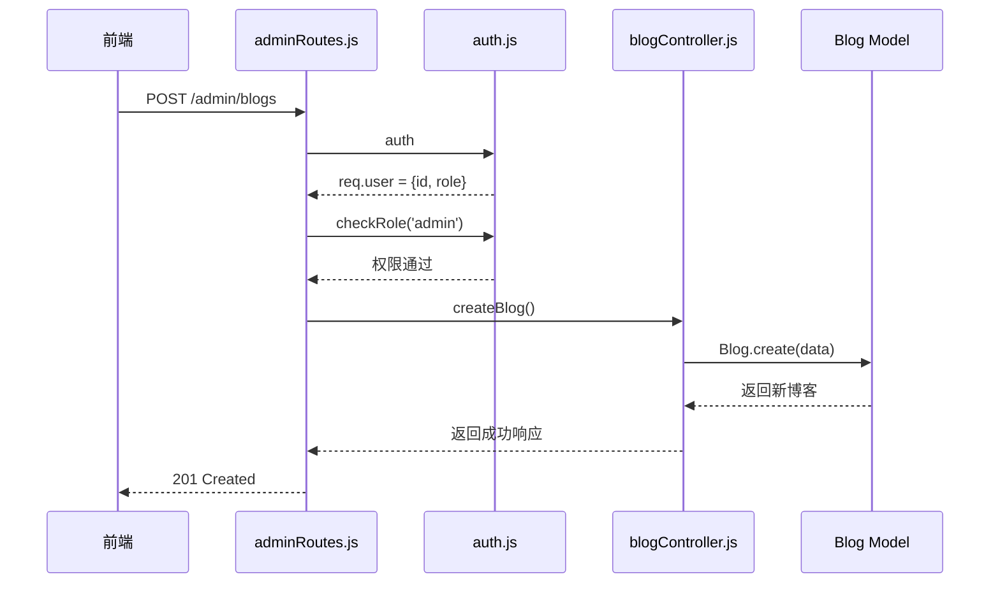
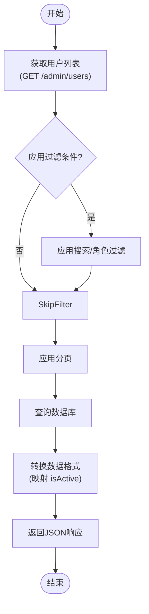

# 后台管理路由与控制器

<cite>
**本文档中引用的文件**   
- [adminRoutes.js](file://backend\routes\adminRoutes.js)
- [auth.js](file://backend\middleware\auth.js)
- [blogController.js](file://backend\controllers\blogController.js)
- [commentController.js](file://backend\controllers\commentController.js)
- [documentController.js](file://backend\controllers\documentController.js)
- [galleryController.js](file://backend\controllers\galleryController.js)
</cite>

## 目录
1. [引言](#引言)
2. [项目结构](#项目结构)
3. [核心组件](#核心组件)
4. [架构概览](#架构概览)
5. [详细组件分析](#详细组件分析)
6. [依赖关系分析](#依赖关系分析)
7. [性能考量](#性能考量)
8. [故障排查指南](#故障排查指南)
9. [结论](#结论)

## 引言
本文档深入解析 my_website 项目的管理员后台 API 设计与实现。重点分析 `adminRoutes.js` 中定义的专用管理接口，这些接口通过权限中间件实现严格的访问控制，并与多个控制器协同工作，完成内容审核、用户管理、数据统计等高级操作。文档将阐述管理员专属功能的实现逻辑，分析管理接口与普通用户接口的复用与隔离策略，并结合代码展示安全与效率考量。

## 项目结构
项目采用典型的前后端分离架构。后端位于 `backend` 目录，遵循 MVC 模式，包含 `controllers`（业务逻辑）、`models`（数据模型）、`routes`（路由定义）和 `middleware`（中间件）等核心模块。前端位于 `frontend` 目录，使用 Vue.js 框架。管理员后台的 API 路由集中定义在 `backend/routes/adminRoutes.js` 文件中，通过 `auth` 和 `checkRole` 中间件进行权限校验。



**图源**
- [adminRoutes.js](file://backend\routes\adminRoutes.js)
- [auth.js](file://backend\middleware\auth.js)

**本节来源**
- [adminRoutes.js](file://backend\routes\adminRoutes.js)
- [auth.js](file://backend\middleware\auth.js)

## 核心组件
管理员后台的核心组件包括：
1.  **权限中间件 (`auth.js`)**：负责 JWT 令牌的验证和角色检查。
2.  **管理路由 (`adminRoutes.js`)**：定义所有管理员专用的 API 端点。
3.  **业务控制器**：如 `blogController.js`、`commentController.js` 等，处理具体的业务逻辑。
4.  **数据模型 (`models/`)**：定义了 `User`、`Blog`、`Comment` 等数据结构。

这些组件共同构成了一个安全、高效的内容管理系统。

**本节来源**
- [adminRoutes.js](file://backend\routes\adminRoutes.js)
- [auth.js](file://backend\middleware\auth.js)
- [blogController.js](file://backend\controllers\blogController.js)

## 架构概览
系统采用分层架构。前端通过 HTTP 请求调用后端 API。`adminRoutes.js` 作为入口，首先通过 `auth` 中间件验证用户身份，再通过 `checkRole('admin')` 确保用户具有管理员权限。通过验证后，请求被分发到相应的控制器（如 `blogController`）执行具体操作，控制器最终与数据库模型交互完成数据的增删改查。



**图源**
- [adminRoutes.js](file://backend\routes\adminRoutes.js#L1-L1017)
- [auth.js](file://backend\middleware\auth.js#L1-L66)
- [blogController.js](file://backend\controllers\blogController.js#L1-L630)

## 详细组件分析

### 管理路由分析
`adminRoutes.js` 文件定义了所有管理员专用的 RESTful API。

#### 路由与权限控制
所有管理路由均使用 `auth` 和 `checkRole('admin')` 中间件进行保护。`auth` 中间件解析 JWT 令牌并将其解码后的用户信息（`id` 和 `role`）附加到 `req.user` 对象上。`checkRole` 中间件则检查 `req.user.role` 是否在允许的角色列表中。

```javascript
// adminRoutes.js
router.get('/verify', auth, checkRole('admin'), async (req, res, next) => {
  // 只有管理员才能访问此路由
  res.json({ success: true, user: req.user })
})
```

#### 内容管理功能
管理员可以对博客、评论、图库、文档等资源进行全生命周期管理。

**博客管理**：提供创建、更新、删除和状态变更（草稿、发布、置顶）的功能。状态变更通过 `PUT /admin/blogs/:id/status` 实现，会自动调整 `pinnedPriority` 字段。

**评论管理**：管理员可以查看所有评论（包括未公开的），并强制更改其可见性（`PUT /admin/comments/:id/visibility`）或直接删除。

**图库管理**：支持图片上传、信息更新和删除。上传功能使用 `multer` 处理文件，并通过 `galleryController.uploadImage` 进行后续处理。

**文档管理**：提供文档的增删改查。文档上传功能在 `documentController.js` 中实现，支持将文件存储到 Vercel Blob。

#### 用户管理功能
管理员可以执行以下操作：
- **获取用户列表**：`GET /admin/users`，支持分页、搜索和按角色过滤。
- **更新用户信息**：`PUT /admin/users/:id/role`，可修改用户名、邮箱、密码和角色。密码会自动加密，邮箱和用户名会进行唯一性校验。
- **删除用户**：`DELETE /admin/users/:id`，但不能删除自己的账户。



**图源**
- [adminRoutes.js](file://backend\routes\adminRoutes.js#L1-L1017)

**本节来源**
- [adminRoutes.js](file://backend\routes\adminRoutes.js#L1-L1017)

### 权限中间件分析
`auth.js` 是整个系统安全的基石。

#### `auth` 中间件
该中间件从 `Authorization` 请求头中提取 `Bearer` 令牌，使用 `JWT_SECRET` 进行验证。验证成功后，将解码的用户信息存入 `req.user`。

#### `checkRole` 中间件
这是一个高阶函数，接收一个角色列表作为参数，并返回一个中间件函数。该函数检查 `req.user` 是否存在且其 `role` 在允许的列表中。

```javascript
// auth.js
exports.checkRole = (...roles) => {
  return (req, res, next) => {
    if (!req.user || !roles.includes(req.user.role)) {
      return next(new ApiError(403, '没有权限执行此操作'))
    }
    next()
  }
}
```

**本节来源**
- [auth.js](file://backend\middleware\auth.js#L1-L66)

### 控制器复用与隔离分析
系统巧妙地复用了部分控制器逻辑，同时通过路由和权限实现了功能隔离。

#### 博客控制器复用
`blogController.js` 中的 `createBlog` 和 `updateBlog` 函数被普通用户和管理员共同使用。但它们的访问路径和权限不同：
- **普通用户**：通过 `/api/blogs` 路由，权限检查在 `updateBlog` 函数内部进行（`if (req.user.role !== 'admin')`）。
- **管理员**：通过 `/admin/blogs` 路由，权限在路由层面由 `checkRole('admin')` 中间件统一处理。

这种设计避免了代码重复，同时保证了权限控制的灵活性。

#### 评论审核逻辑
评论的可见性控制也体现了复用与隔离。普通用户更新评论时，只能修改自己的评论内容。而管理员通过专用的 `moderateComment` 接口（`PUT /admin/comments/:id/visibility`）可以强制更改任何评论的 `isPublic` 状态。

**本节来源**
- [blogController.js](file://backend\controllers\blogController.js#L1-L630)
- [commentController.js](file://backend\controllers\commentController.js#L1-L467)
- [adminRoutes.js](file://backend\routes\adminRoutes.js#L1-L1017)

## 依赖关系分析
系统各模块间依赖关系清晰。`adminRoutes.js` 依赖于 `auth.js` 进行权限校验，并依赖于各个 `controller` 模块处理业务逻辑。`controller` 模块则依赖于 `models` 模块与数据库交互。`galleryController.js` 和 `documentController.js` 还依赖于 `@vercel/blob` 进行云存储操作。

```mermaid
graph TD
A[adminRoutes.js] --> B[auth.js]
A --> C[blogController.js]
A --> D[commentController.js]
A --> E[documentController.js]
A --> F[galleryController.js]
C --> G[Blog Model]
D --> H[Comment Model]
E --> I[Document Model]
F --> J[Gallery Model]
F --> K[@vercel/blob]
E --> K
```

**图源**
- [adminRoutes.js](file://backend\routes\adminRoutes.js)
- [blogController.js](file://backend\controllers\blogController.js)
- [commentController.js](file://backend\controllers\commentController.js)
- [documentController.js](file://backend\controllers\documentController.js)
- [galleryController.js](file://backend\controllers\galleryController.js)

**本节来源**
- [adminRoutes.js](file://backend\routes\adminRoutes.js)
- [blogController.js](file://backend\controllers\blogController.js)
- [commentController.js](file://backend\controllers\commentController.js)
- [documentController.js](file://backend\controllers\documentController.js)
- [galleryController.js](file://backend\controllers\galleryController.js)

## 性能考量
系统在性能方面有以下考量：
1.  **数据库查询优化**：在获取列表时，使用 `Promise.all` 并行执行数据查询和总数统计，减少了数据库往返次数。
2.  **分页**：所有列表接口都支持分页，避免一次性加载过多数据。
3.  **文件处理**：使用 `sharp` 库在服务器端处理图片缩略图，减轻前端负担。
4.  **云存储**：利用 Vercel Blob 存储大文件，提高文件访问速度和系统可扩展性。

## 故障排查指南
### 常见问题与解决方案
- **问题：管理员无法访问 `/admin/verify`**
  - **原因**：JWT 令牌无效或已过期。
  - **解决方案**：检查 `Authorization` 头是否正确，确认 `JWT_SECRET` 环境变量配置正确。

- **问题：上传文档失败**
  - **原因**：`BLOB_READ_WRITE_TOKEN` 未配置，或上传的文件类型不被 `fileFilter` 函数允许。
  - **解决方案**：检查环境变量，并确认上传的文件扩展名在允许列表中。

- **问题：评论无法正确显示**
  - **原因**：`getCommentsByTarget` 函数中，对 `General` 类型评论的处理可能出错。
  - **解决方案**：检查 `targetType` 是否为 `General`，并确保 `targetTitle` 被正确设置。

**本节来源**
- [adminRoutes.js](file://backend\routes\adminRoutes.js)
- [auth.js](file://backend\middleware\auth.js)
- [documentController.js](file://backend\controllers\documentController.js)

## 结论
my_website 的管理员后台 API 设计合理，通过 `adminRoutes.js` 集中管理所有管理功能，并利用 `auth.js` 中间件实现了严格的权限控制。系统通过复用控制器逻辑和隔离路由的方式，平衡了代码复用性和安全性。结合 Vercel Blob 等现代云服务，系统在性能和可扩展性方面也表现出色。整体架构清晰，易于维护和扩展。