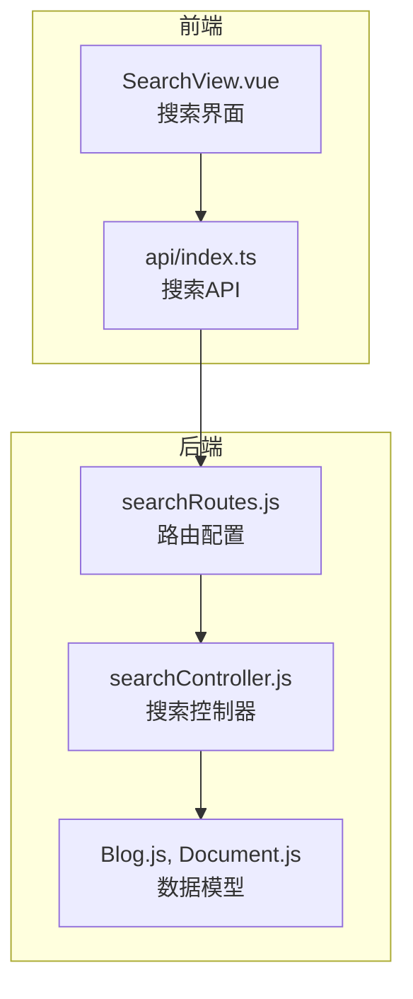
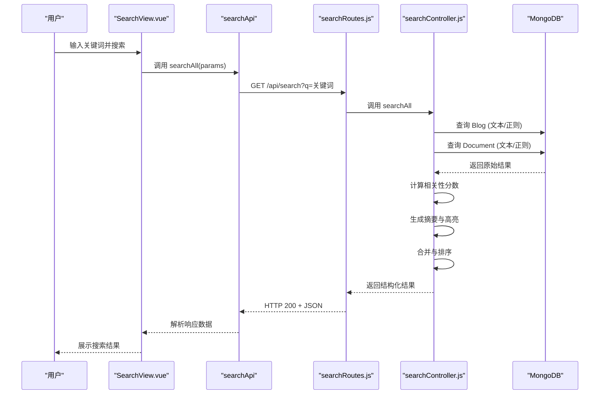
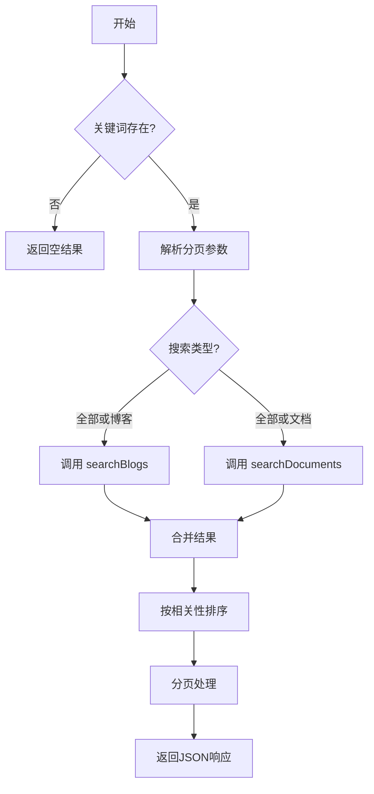
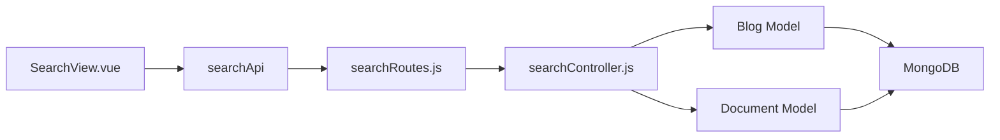

# 全局搜索系统路由与控制器

<cite>
**本文档引用的文件**  
- [searchRoutes.js](file://backend/routes/searchRoutes.js)
- [searchController.js](file://backend/controllers/searchController.js)
- [SearchView.vue](file://frontend/src/views/SearchView.vue)
</cite>

## 目录
1. [简介](#简介)
2. [项目结构](#项目结构)
3. [核心组件](#核心组件)
4. [架构概览](#架构概览)
5. [详细组件分析](#详细组件分析)
6. [依赖分析](#依赖分析)
7. [性能考量](#性能考量)
8. [故障排除指南](#故障排除指南)
9. [结论](#结论)

## 简介
本文档详细解析了网站全局搜索功能的实现机制，涵盖从路由配置、控制器逻辑到前端展示的完整流程。系统通过单一入口 `/api/search` 实现跨内容类型的全文检索，支持博客和文档库的联合搜索，并具备关键词高亮、摘要生成、结果排序与分页等高级功能。文档深入剖析了搜索查询的解析逻辑、多级匹配策略（MongoDB文本索引与正则表达式）、结果聚合算法及用户体验优化技术。

## 项目结构
全局搜索功能涉及前后端多个模块，其结构清晰，职责分明：



**图示来源**  
- [searchRoutes.js](file://backend/routes/searchRoutes.js)
- [searchController.js](file://backend/controllers/searchController.js)
- [SearchView.vue](file://frontend/src/views/SearchView.vue)

**本节来源**  
- [searchRoutes.js](file://backend/routes/searchRoutes.js)
- [searchController.js](file://backend/controllers/searchController.js)
- [SearchView.vue](file://frontend/src/views/SearchView.vue)

## 核心组件
全局搜索系统的核心由三个主要组件构成：前端搜索视图、后端路由配置和搜索控制器。`searchRoutes.js` 定义了统一的搜索接口，`searchController.js` 实现了跨模型的搜索逻辑，而 `SearchView.vue` 提供了用户交互界面。系统支持按类型过滤（全部、博客、文档），并返回结构化的搜索结果，包括标题、摘要、元数据和标签。

**本节来源**  
- [searchRoutes.js](file://backend/routes/searchRoutes.js#L1-L17)
- [searchController.js](file://backend/controllers/searchController.js#L1-L51)
- [SearchView.vue](file://frontend/src/views/SearchView.vue#L1-L631)

## 架构概览
系统采用典型的前后端分离架构，通过RESTful API进行通信。搜索请求由前端发起，经由Express路由转发至控制器，控制器并行查询多个数据模型，聚合结果后返回。



**图示来源**  
- [searchRoutes.js](file://backend/routes/searchRoutes.js#L1-L17)
- [searchController.js](file://backend/controllers/searchController.js#L1-L373)
- [SearchView.vue](file://frontend/src/views/SearchView.vue#L1-L631)

## 详细组件分析

### 搜索路由配置分析
`searchRoutes.js` 文件定义了全局搜索的唯一入口，采用Express框架的Router模块进行配置。

```javascript
const express = require('express');
const router = express.Router();
const searchController = require('../controllers/searchController');
const { optionalAuth } = require('../middleware/auth');

// 统一搜索接口
router.get('/', optionalAuth, searchController.searchAll);

module.exports = router;
```

该路由配置了 `/api/search` 的GET请求，使用 `optionalAuth` 中间件进行可选认证，允许未登录用户也能使用搜索功能，同时为已登录用户提供个性化结果。所有请求最终由 `searchController.searchAll` 处理。

**本节来源**  
- [searchRoutes.js](file://backend/routes/searchRoutes.js#L1-L17)

### 搜索控制器逻辑分析
`searchController.js` 是搜索功能的核心，实现了 `searchAll`、`searchBlogs`、`searchDocuments` 等关键函数。

#### 统一搜索接口流程


**图示来源**  
- [searchController.js](file://backend/controllers/searchController.js#L22-L51)

#### 搜索查询解析与模糊匹配
系统采用多级查询策略确保搜索的鲁棒性：

1.  **优先使用MongoDB文本索引**：对于支持文本搜索的字段，使用 `$text` 和 `$search` 操作符，利用数据库的内置全文检索能力，效率高且支持相关性评分（`$meta: 'textScore'`）。
2.  **降级使用正则匹配**：当文本索引不可用或结果不足时，回退到正则表达式（`$regex`）进行模糊匹配，支持不区分大小写的搜索。
3.  **多字段覆盖**：在博客搜索中，同时查询 `title`、`content`、`excerpt`、`category` 和 `tags` 字段；在文档搜索中，查询 `title`、`description`、`category` 和 `secondaryTags` 字段。

```javascript
// 博客正则查询示例
const regexSearchQuery = {
  ...baseQuery,
  $or: [
    { title: { $regex: searchTerm, $options: 'i' } },
    { content: { $regex: searchTerm, $options: 'i' } },
    { excerpt: { $regex: searchTerm, $options: 'i' } },
    { category: { $regex: searchTerm, $options: 'i' } },
    { tags: { $in: [new RegExp(searchTerm, 'i')] } }
  ]
};
```

**本节来源**  
- [searchController.js](file://backend/controllers/searchController.js#L85-L135)
- [searchController.js](file://backend/controllers/searchController.js#L185-L230)

#### 结果聚合与排序机制
控制器将来自不同模型（博客、文档）的结果合并，并通过计算**相关性分数**进行排序。

-   **相关性评分算法**：
    -   标题匹配：+10分
    -   摘要/描述匹配：+8或+5分
    -   内容匹配：+5分
    -   分类匹配：+3分
    -   标签匹配：+2分

```javascript
// 计算博客相关性分数
if (lowerTitle.includes(lowerSearchTerm)) relevanceScore += 10;
if (lowerExcerpt.includes(lowerSearchTerm)) relevanceScore += 8;
if (lowerContent.includes(lowerSearchTerm)) relevanceScore += 5;
```

最终结果按 `relevanceScore` 降序排列，确保最相关的内容排在前面。

**本节来源**  
- [searchController.js](file://backend/controllers/searchController.js#L137-L161)
- [searchController.js](file://backend/controllers/searchController.js#L228-L266)

#### 用户体验优化技术
系统实现了多项技术以提升用户体验：

-   **分页处理**：支持 `page` 和 `pageSize` 参数，返回 `total`、`totalPages` 等分页信息。
-   **高亮显示**：`highlightKeywords` 函数将搜索关键词包裹在 `<mark>` 标签中，前端CSS将其渲染为黄色背景。
-   **摘要生成**：`generateSearchSnippet` 函数从内容中提取包含关键词的片段，并添加省略号，帮助用户快速定位。

```javascript
// 高亮关键词
function highlightKeywords(text, searchTerm) {
  const regex = new RegExp(`(${word.replace(/[.*+?^${}()|[\]\\]/g, '\\$&')})`, 'gi');
  return text.replace(regex, '<mark>$1</mark>');
}
```

**本节来源**  
- [searchController.js](file://backend/controllers/searchController.js#L355-L373)
- [searchController.js](file://backend/controllers/searchController.js#L335-L353)
- [SearchView.vue](file://frontend/src/views/SearchView.vue#L610-L615)

### 前端搜索视图分析
`SearchView.vue` 是用户交互的入口，它处理搜索请求、展示结果和分页。

-   **搜索过滤**：提供“全部”、“博客”、“文档”三个过滤按钮，通过 `type` 参数控制后端查询范围。
-   **状态管理**：清晰地展示了加载中、错误和无结果三种状态。
-   **结果展示**：每个结果项包含图标、标题（含高亮）、URL、摘要、元数据（日期、分类、下载量）和标签。

```javascript
// 前端搜索方法
const search = async (query, page = 1) => {
  const params = { q: query, page, pageSize: 10 };
  if (activeFilter.value !== 'all') params.type = activeFilter.value;
  const response = await searchApi.searchAll(params);
  // 更新状态
};
```

**本节来源**  
- [SearchView.vue](file://frontend/src/views/SearchView.vue#L182-L254)
- [SearchView.vue](file://frontend/src/views/SearchView.vue#L0-L631)

## 依赖分析
全局搜索功能的依赖关系清晰，形成了一个单向的数据流。



前端组件依赖于API服务，API服务依赖于后端路由，路由依赖于控制器，控制器最终依赖于数据模型和数据库。这种分层设计降低了耦合度，便于维护和测试。

**图示来源**  
- [searchRoutes.js](file://backend/routes/searchRoutes.js)
- [searchController.js](file://backend/controllers/searchController.js)
- [SearchView.vue](file://frontend/src/views/SearchView.vue)

**本节来源**  
- [searchRoutes.js](file://backend/routes/searchRoutes.js)
- [searchController.js](file://backend/controllers/searchController.js)
- [SearchView.vue](file://frontend/src/views/SearchView.vue)

## 性能考量
尽管当前实现功能完整，但仍存在性能优化空间：

-   **索引构建**：必须为 `Blog` 和 `Document` 模型中参与文本搜索的字段（如 `title`, `content`）创建MongoDB文本索引，否则 `$text` 查询将无法使用。
-   **性能瓶颈**：`searchBlogs` 和 `searchDocuments` 是串行调用的，可以使用 `Promise.all` 并行执行以减少总响应时间。
-   **缓存方案**：对于高频搜索词，可以使用Redis缓存结果，显著降低数据库负载和响应延迟。
-   **安全措施**：应实施速率限制（Rate Limiting）以防止高频搜索攻击，保护后端服务。

## 故障排除指南
-   **搜索无结果**：检查MongoDB文本索引是否已创建，确认搜索关键词与内容匹配。
-   **接口404错误**：检查 `searchRoutes.js` 是否已正确挂载到主应用路由。
-   **高亮不显示**：确认前端CSS中 `:deep(mark)` 选择器已正确应用样式。
-   **分页失效**：检查 `searchController.js` 中的分页逻辑，确保 `startIndex` 和 `slice` 计算正确。

**本节来源**  
- [searchController.js](file://backend/controllers/searchController.js)
- [SearchView.vue](file://frontend/src/views/SearchView.vue)

## 结论
全局搜索系统通过 `searchRoutes.js` 和 `searchController.js` 的协同工作，成功实现了跨内容类型的统一检索。系统设计合理，功能完备，支持关键词高亮、摘要生成和分页。未来可通过引入并行查询、结果缓存和速率限制等措施，进一步提升性能和安全性。前端 `SearchView.vue` 提供了直观的用户界面，完整地展示了搜索结果的各个方面，为用户提供了良好的搜索体验。