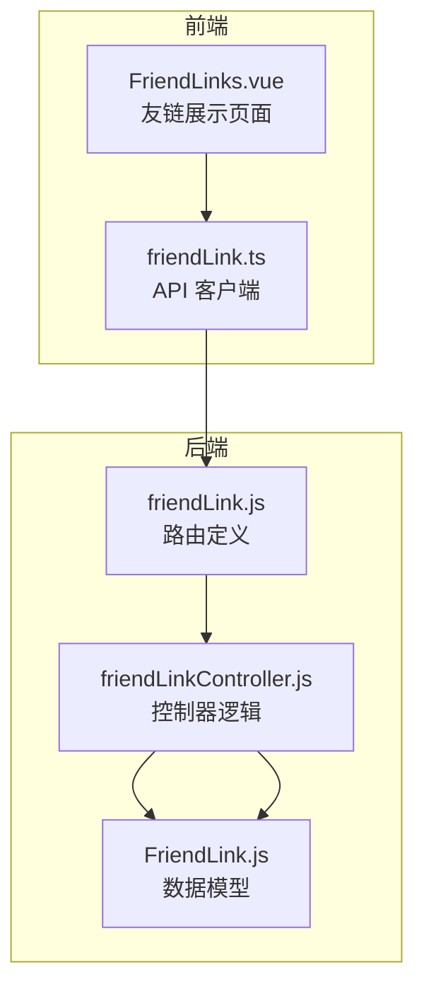
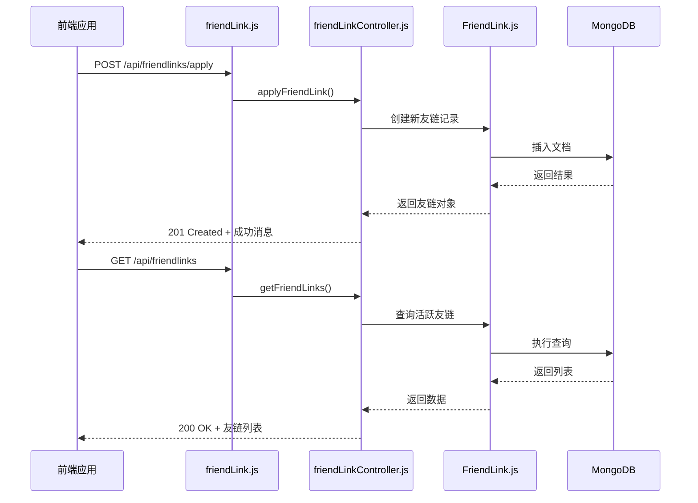
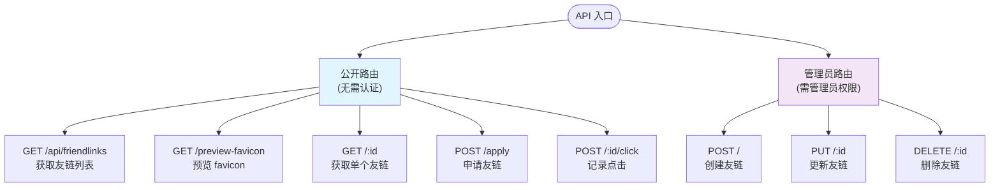
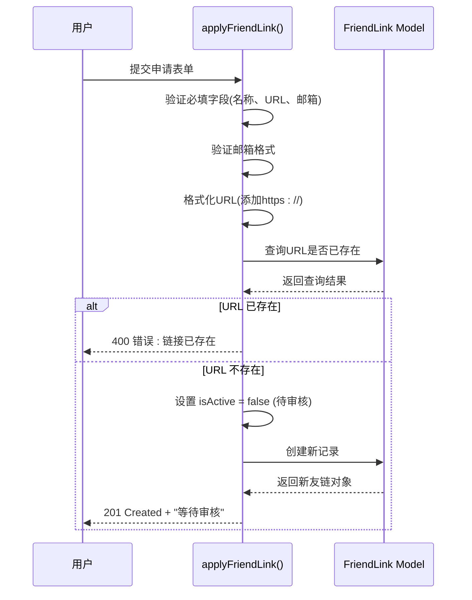
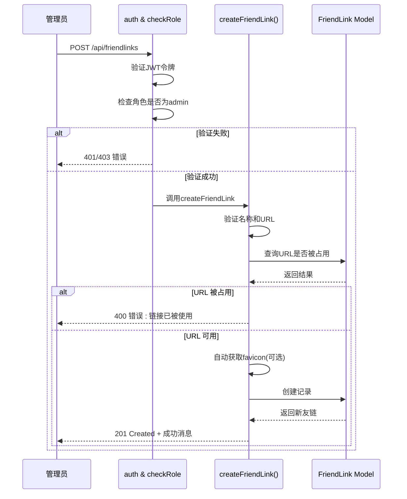
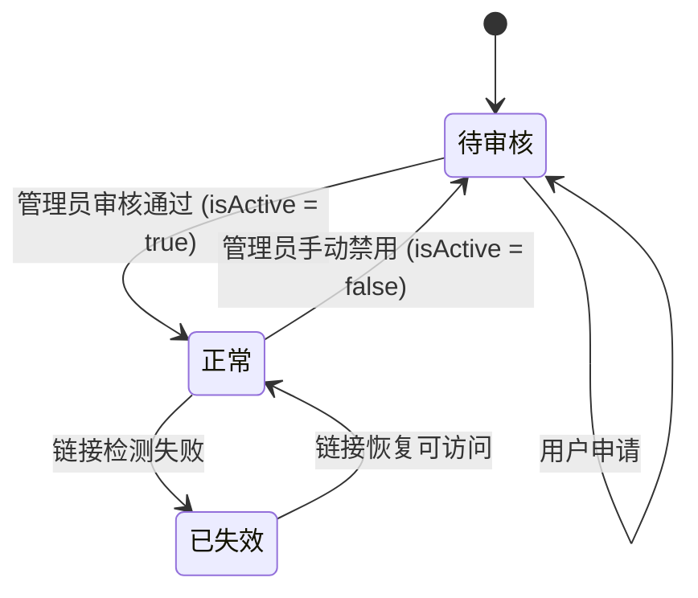
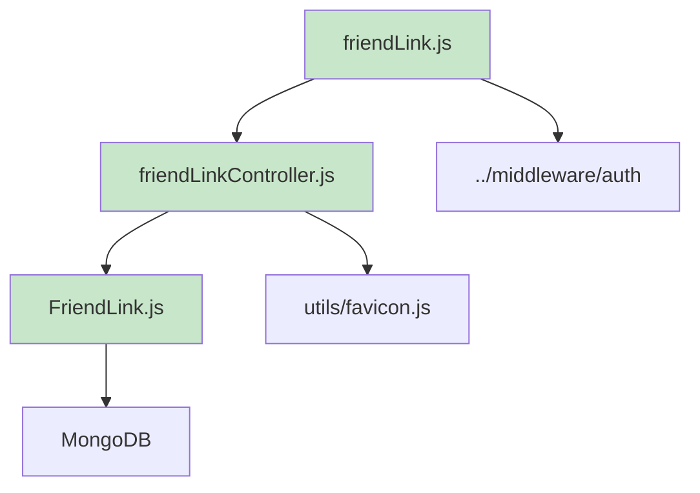

# 友情链接系统路由与控制器

<cite>
**本文档引用文件**  
- [friendLink.js](file://backend/routes/friendLink.js)
- [friendLinkController.js](file://backend/controllers/friendLinkController.js)
- [FriendLink.js](file://backend/models/FriendLink.js)
</cite>

## 目录
1. [简介](#简介)
2. [项目结构](#项目结构)
3. [核心组件](#核心组件)
4. [架构概览](#架构概览)
5. [详细组件分析](#详细组件分析)
6. [依赖分析](#依赖分析)
7. [性能考虑](#性能考虑)
8. [故障排除指南](#故障排除指南)
9. [结论](#结论)

## 简介
本文档全面阐述了网站友情链接模块的实现机制，涵盖从用户申请、管理员审核、数据存储到前端展示的完整流程。系统通过 `friendLink.js` 定义路由规则，`friendLinkController.js` 处理业务逻辑，以及 `FriendLink.js` 模型定义数据结构，实现了友链的申请、审核、展示、更新和删除功能。重点包括状态机管理（待审核/已激活）、URL 可达性验证、防重复提交机制、权限控制策略及自动化 favicon 获取等特性。

## 项目结构
友情链接功能分布在后端的 `routes`、`controllers` 和 `models` 三个目录中，遵循典型的 MVC 架构模式。前端通过 API 调用与后端交互，实现友链的申请与展示。



**图示来源**
- [friendLink.js](file://backend/routes/friendLink.js)
- [friendLinkController.js](file://backend/controllers/friendLinkController.js)
- [FriendLink.js](file://backend/models/FriendLink.js)

**本节来源**
- [friendLink.js](file://backend/routes/friendLink.js)
- [friendLinkController.js](file://backend/controllers/friendLinkController.js)
- [FriendLink.js](file://backend/models/FriendLink.js)

## 核心组件
核心组件包括路由定义、控制器逻辑和数据模型。路由负责分发请求，控制器处理具体业务，模型定义数据结构与行为。

**本节来源**
- [friendLink.js](file://backend/routes/friendLink.js#L1-L33)
- [friendLinkController.js](file://backend/controllers/friendLinkController.js#L1-L352)
- [FriendLink.js](file://backend/models/FriendLink.js#L1-L203)

## 架构概览
系统采用分层架构，前端通过 HTTP 请求与后端 API 交互。后端 Express 应用根据路由将请求分发至控制器，控制器调用模型进行数据操作，并返回 JSON 响应。



**图示来源**
- [friendLink.js](file://backend/routes/friendLink.js#L1-L33)
- [friendLinkController.js](file://backend/controllers/friendLinkController.js#L1-L352)
- [FriendLink.js](file://backend/models/FriendLink.js#L1-L203)

## 详细组件分析

### 路由定义分析
`friendLink.js` 文件定义了所有与友情链接相关的 API 端点，明确区分了公开接口和管理员专用接口。

#### 路由结构


**图示来源**
- [friendLink.js](file://backend/routes/friendLink.js#L1-L33)

**本节来源**
- [friendLink.js](file://backend/routes/friendLink.js#L1-L33)

### 控制器逻辑分析
`friendLinkController.js` 包含所有业务逻辑函数，处理请求、验证数据、调用模型并返回响应。

#### 申请与审核流程


**图示来源**
- [friendLinkController.js](file://backend/controllers/friendLinkController.js#L250-L352)
- [FriendLink.js](file://backend/models/FriendLink.js#L1-L203)

#### 管理员操作流程


**图示来源**
- [friendLink.js](file://backend/routes/friendLink.js#L20-L23)
- [friendLinkController.js](file://backend/controllers/friendLinkController.js#L50-L150)

**本节来源**
- [friendLinkController.js](file://backend/controllers/friendLinkController.js#L1-L352)

### 数据模型分析
`FriendLink.js` 定义了友情链接的数据结构、验证规则、索引和方法。

#### 数据模型结构
```mermaid
classDiagram
class FriendLink {
+String name
+String url
+String avatar
+String description
+String category
+String[] tags
+Number visitCount
+Date lastChecked
+String status
+Boolean isActive
+String email
+String contactInfo
+String remark
+Date createdAt
+Date updatedAt
+String formattedUrl
+incrementVisit() Number
+checkAccessibility() Object
+static checkAllLinks() Object[]
}
note right of FriendLink
状态枚举 : 正常, 待审核, 已失效
分类枚举 : 个人博客, 技术社区, 学习资源, 工具网站, 友情链接, 其他
isActive=true → status='正常'
isActive=false → status='待审核'
end
```

**图示来源**
- [FriendLink.js](file://backend/models/FriendLink.js#L1-L203)

#### 状态机机制


**图示来源**
- [FriendLink.js](file://backend/models/FriendLink.js#L150-L160)
- [friendLinkController.js](file://backend/controllers/friendLinkController.js#L280-L285)

**本节来源**
- [FriendLink.js](file://backend/models/FriendLink.js#L1-L203)

## 依赖分析
系统内部依赖清晰，控制器依赖模型，路由依赖控制器。外部依赖包括 Mongoose（数据库）、Express（Web 框架）和用于获取 favicon 的工具模块。



**图示来源**
- [friendLink.js](file://backend/routes/friendLink.js#L3,L5)
- [friendLinkController.js](file://backend/controllers/friendLinkController.js#L1,L3)
- [FriendLink.js](file://backend/models/FriendLink.js#L1)

**本节来源**
- [friendLink.js](file://backend/routes/friendLink.js#L1-L33)
- [friendLinkController.js](file://backend/controllers/friendLinkController.js#L1-L352)
- [FriendLink.js](file://backend/models/FriendLink.js#L1-L203)

## 性能考虑
- **数据库索引**：在 `category`、`isActive`、`status` 和 `visitCount` 字段上建立了索引，确保查询效率。
- **分页支持**：`getFriendLinks` 接口支持分页，避免一次性加载过多数据。
- **缓存建议**：对于频繁访问的友链列表，建议在前端或使用 Redis 进行缓存，减少数据库查询压力。
- **批量检测**：`checkAllLinks` 静态方法可用于定时任务，批量检测友链有效性，避免单个请求阻塞。

## 故障排除指南
- **申请失败**：检查是否已存在相同 URL 的友链，或邮箱格式是否正确。
- **无法获取 favicon**：确保 `utils/favicon.js` 模块正常工作，或检查目标网站是否允许 favicon 访问。
- **管理员接口 403 错误**：确认请求头中包含有效的 JWT 令牌，且用户角色为 `admin`。
- **死链问题**：定期调用 `checkAllLinks` 方法或设置定时任务，自动检测并标记失效链接。
- **垃圾申请泛滥**：可增加验证码（CAPTCHA）机制，或限制同一 IP 的申请频率。

## 结论
友情链接系统通过清晰的路由设计、严谨的控制器逻辑和健壮的数据模型，实现了完整的友链管理功能。系统具备良好的安全性（权限控制）、可用性（状态机）和扩展性（索引与方法）。建议未来增加验证码、自动死链检测定时任务和前端缓存机制，以进一步提升系统稳定性和用户体验。