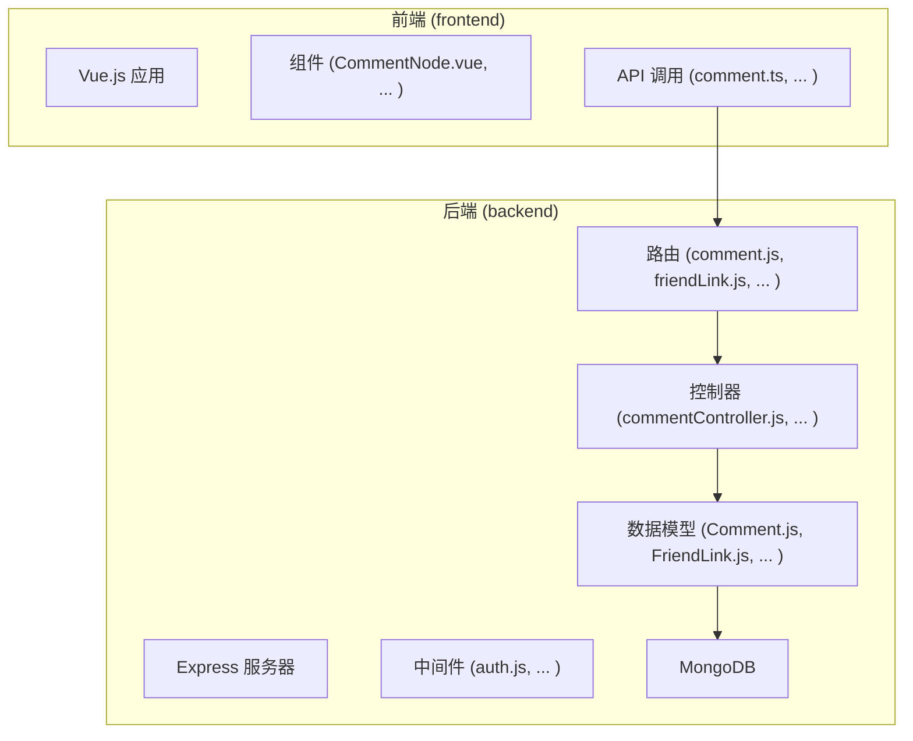
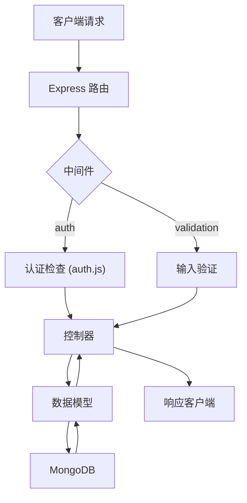
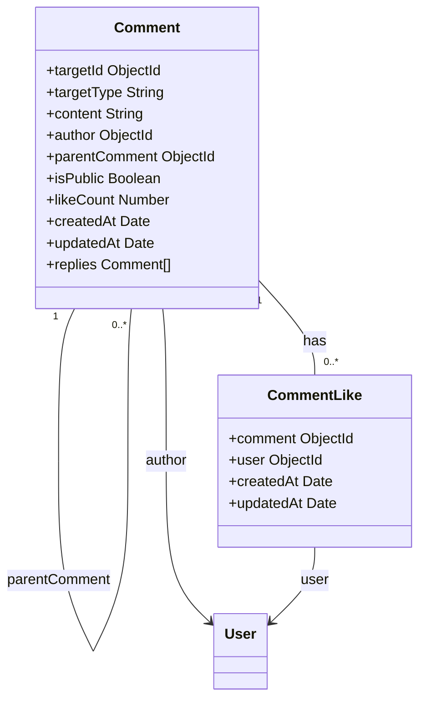
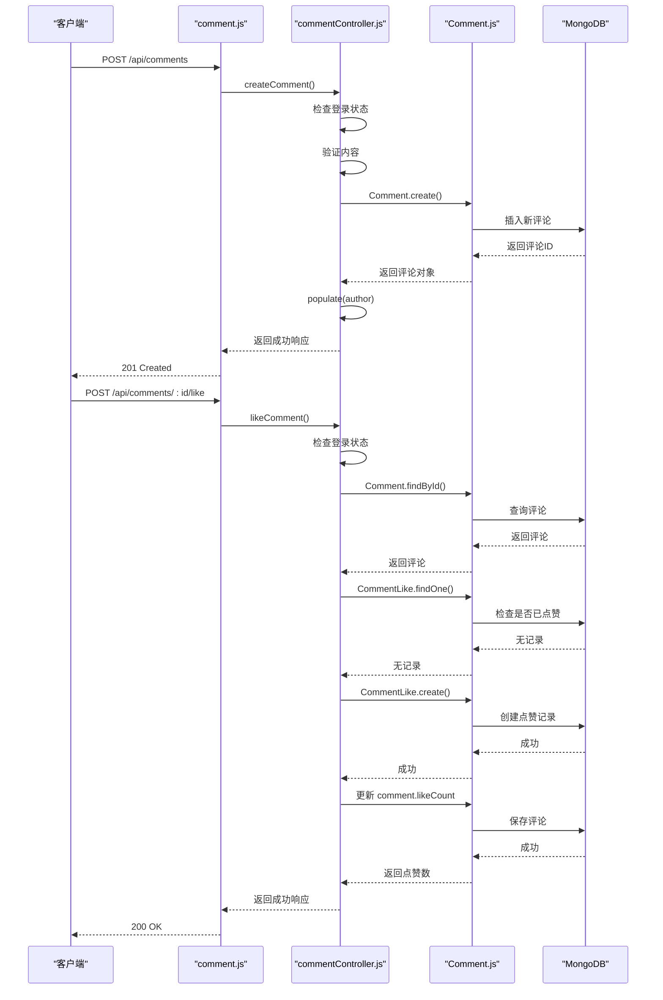
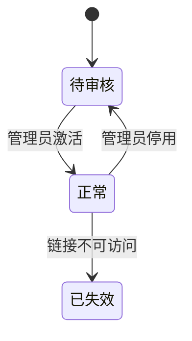
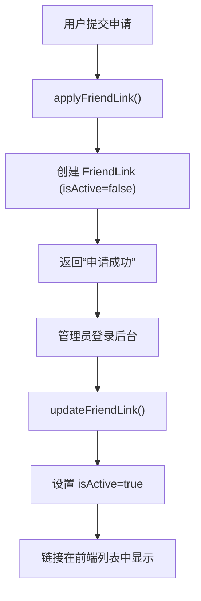
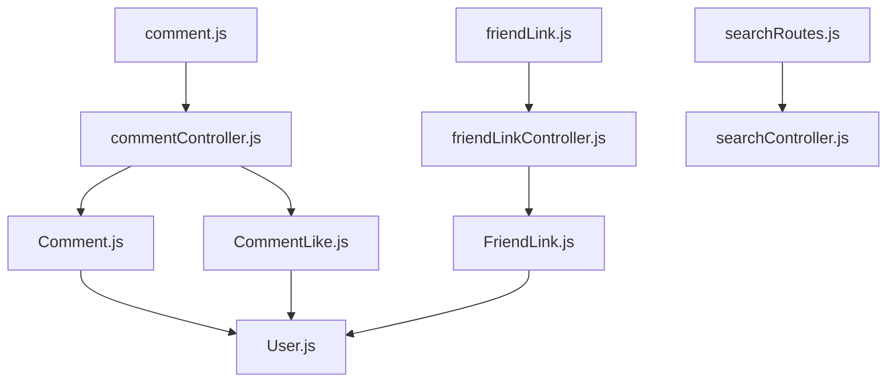

# 用户交互路由与控制器

<cite>
**本文档引用文件**  
- [comment.js](file://backend/routes/comment.js#L1-L46)
- [commentController.js](file://backend/controllers/commentController.js#L1-L467)
- [Comment.js](file://backend/models/Comment.js#L1-L82)
- [CommentLike.js](file://backend/models/CommentLike.js#L1-L31)
- [friendLink.js](file://backend/routes/friendLink.js#L1-L33)
- [friendLinkController.js](file://backend/controllers/friendLinkController.js#L1-L351)
- [FriendLink.js](file://backend/models/FriendLink.js#L1-L202)
- [searchRoutes.js](file://backend/routes/searchRoutes.js)
- [searchController.js](file://backend/controllers/searchController.js)
</cite>

## 目录
1. [简介](#简介)
2. [项目结构](#项目结构)
3. [核心组件](#核心组件)
4. [架构概览](#架构概览)
5. [详细组件分析](#详细组件分析)
6. [依赖关系分析](#依赖关系分析)
7. [性能考量](#性能考量)
8. [故障排查指南](#故障排查指南)
9. [结论](#结论)

## 简介
本文件旨在系统解析 `my_website` 项目中用户交互功能的实现机制，重点聚焦于评论系统、友情链接模块和全局搜索功能。通过深入分析后端路由、控制器逻辑与数据模型设计，揭示其多级嵌套评论结构、审核流程、点赞机制、友链申请与展示逻辑，以及跨内容类型的全文检索策略。文档结合代码实例与可视化图表，为开发者提供清晰的技术蓝图，并提出优化建议。

## 项目结构
项目采用典型的前后端分离架构。前端位于 `frontend` 目录，使用 Vue.js 框架构建。后端位于 `backend` 目录，基于 Node.js 和 Express 框架，遵循 MVC 模式组织代码。核心交互逻辑集中在 `backend/routes` 和 `backend/controllers` 中，数据模型定义于 `backend/models`。



**图示来源**
- [comment.js](file://backend/routes/comment.js#L1-L46)
- [commentController.js](file://backend/controllers/commentController.js#L1-L467)
- [Comment.js](file://backend/models/Comment.js#L1-L82)

**本节来源**
- [comment.js](file://backend/routes/comment.js#L1-L46)
- [commentController.js](file://backend/controllers/commentController.js#L1-L467)

## 核心组件
本系统的核心交互功能由三大模块构成：**评论系统**、**友情链接模块**和**全局搜索功能**。它们分别通过独立的路由、控制器和数据模型实现，共同支撑了网站的用户互动生态。

**本节来源**
- [comment.js](file://backend/routes/comment.js#L1-L46)
- [friendLink.js](file://backend/routes/friendLink.js#L1-L33)
- [searchRoutes.js](file://backend/routes/searchRoutes.js)

## 架构概览
系统后端采用分层架构，清晰地分离了网络请求处理、业务逻辑和数据访问。Express 路由接收 HTTP 请求，通过中间件（如认证）后，将控制权交给控制器。控制器调用模型方法与数据库交互，完成业务逻辑后返回响应。



**图示来源**
- [comment.js](file://backend/routes/comment.js#L1-L46)
- [middleware/auth.js](file://backend/middleware/auth.js)
- [commentController.js](file://backend/controllers/commentController.js#L1-L467)
- [Comment.js](file://backend/models/Comment.js#L1-L82)

## 详细组件分析

### 评论系统分析
评论系统实现了多级嵌套评论、审核、点赞等复杂功能，其核心由 `comment.js` (路由)、`commentController.js` (控制器) 和 `Comment.js` (数据模型) 构成。

#### 数据模型设计
`Comment` 模型采用树形结构设计，通过 `parentComment` 字段引用自身，实现评论与回复的关联。`targetType` 和 `targetId` 字段使其能关联到博客、图库、文档等多种内容。`isPublic` 字段用于实现审核状态机。



**图示来源**
- [Comment.js](file://backend/models/Comment.js#L1-L82)
- [CommentLike.js](file://backend/models/CommentLike.js#L1-L31)

#### API 调用流程
以下序列图展示了用户发布一条新评论并点赞的完整流程。



**图示来源**
- [comment.js](file://backend/routes/comment.js#L1-L46)
- [commentController.js](file://backend/controllers/commentController.js#L1-L467)
- [Comment.js](file://backend/models/Comment.js#L1-L82)

**本节来源**
- [comment.js](file://backend/routes/comment.js#L1-L46)
- [commentController.js](file://backend/controllers/commentController.js#L1-L467)
- [Comment.js](file://backend/models/Comment.js#L1-L82)

#### 递归数据结构处理
获取评论列表时，`getCommentsByTarget` 控制器使用递归函数 `getReplies` 来填充所有层级的回复。此方法先获取顶层评论，再为每个顶层评论递归获取其所有子评论，最终形成完整的树形结构。

```javascript
// 伪代码：递归获取回复
const getReplies = async (commentId) => {
  const replies = await Comment.find({ parentComment: commentId });
  for (const reply of replies) {
    reply.replies = await getReplies(reply._id); // 递归调用
  }
  return replies;
}
```

**本节来源**
- [commentController.js](file://backend/controllers/commentController.js#L150-L190)

### 友情链接模块分析
该模块允许用户申请友链，管理员审核并管理，同时支持公开展示。

#### 数据模型与状态机
`FriendLink` 模型通过 `isActive` 和 `status` 字段管理链接状态。`isActive: false` 表示待审核，`isActive: true` 表示已激活。`status` 字段是 `isActive` 的衍生状态，由 pre-save 中间件自动维护。



**图示来源**
- [FriendLink.js](file://backend/models/FriendLink.js#L1-L202)

#### 功能流程
用户通过 `/api/friendlinks/apply` 提交申请，数据存入数据库且 `isActive` 为 `false`。管理员在后台审核后，通过 `/api/friendlinks/:id` 的 `PUT` 接口更新 `isActive` 状态，使其在前端公开列表中显示。



**图示来源**
- [friendLink.js](file://backend/routes/friendLink.js#L1-L33)
- [friendLinkController.js](file://backend/controllers/friendLinkController.js#L1-L351)

**本节来源**
- [friendLink.js](file://backend/routes/friendLink.js#L1-L33)
- [friendLinkController.js](file://backend/controllers/friendLinkController.js#L1-L351)
- [FriendLink.js](file://backend/models/FriendLink.js#L1-L202)

### 全局搜索功能分析
虽然未提供 `searchRoutes.js` 和 `searchController.js` 的具体内容，但根据其命名和项目结构，可推断其实现了跨博客、文档、图库的全文检索。

#### 潜在实现策略
1.  **文本索引**：在 `Blog`、`Document`、`Gallery` 等模型上建立 MongoDB 文本索引。
2.  **聚合查询**：使用 `$text` 搜索操作符，对多个集合进行查询，然后合并结果。
3.  **分页与排序**：对聚合结果进行分页和相关性排序。

**本节来源**
- [searchRoutes.js](file://backend/routes/searchRoutes.js)
- [searchController.js](file://backend/controllers/searchController.js)

## 依赖关系分析
各组件间依赖关系清晰，遵循低耦合原则。



**图示来源**
- [comment.js](file://backend/routes/comment.js#L1-L46)
- [commentController.js](file://backend/controllers/commentController.js#L1-L467)
- [Comment.js](file://backend/models/Comment.js#L1-L82)
- [FriendLink.js](file://backend/models/FriendLink.js#L1-L202)

**本节来源**
- [comment.js](file://backend/routes/comment.js#L1-L46)
- [friendLink.js](file://backend/routes/friendLink.js#L1-L33)

## 性能考量
1.  **评论加载延迟**：深度嵌套的评论树在递归查询时可能导致性能瓶颈。建议实现**分页加载回复**，即首次只加载顶层评论，点击“展开回复”时再按页加载特定评论的回复。
2.  **数据库查询优化**：`Comment` 模型已为 `targetId, targetType, isPublic` 和 `createdAt` 建立索引，能有效加速查询。`FriendLink` 的文本索引也利于搜索。
3.  **数据一致性**：当删除一篇博客时，其关联的评论未被自动清理。建议在 `blogController.js` 的删除逻辑中，添加 `Comment.deleteMany({ targetId: blogId, targetType: 'Blog' })` 来维护数据一致性。

## 故障排查指南
-  **问题**：用户无法发表评论。
  - **检查**：确认用户是否已登录（`req.user` 是否存在），评论内容是否为空。
-  **问题**：评论点赞不成功。
  - **检查**：确认用户是否已登录，是否已重复点赞（`CommentLike` 模型的唯一索引会阻止重复记录）。
-  **问题**：申请的友链未在列表中显示。
  - **检查**：确认 `FriendLink` 记录的 `isActive` 字段是否为 `true`，管理员是否已完成审核。

**本节来源**
- [commentController.js](file://backend/controllers/commentController.js#L1-L467)
- [friendLinkController.js](file://backend/controllers/friendLinkController.js#L1-L351)

## 结论
`my_website` 的用户交互功能设计合理，通过模块化的路由、控制器和数据模型，实现了功能丰富且可扩展的评论、友链和搜索系统。其亮点在于评论的递归树形结构处理和友链的状态机管理。未来优化方向包括改进评论加载策略以提升性能，并完善内容删除时的级联清理逻辑以保证数据完整性。