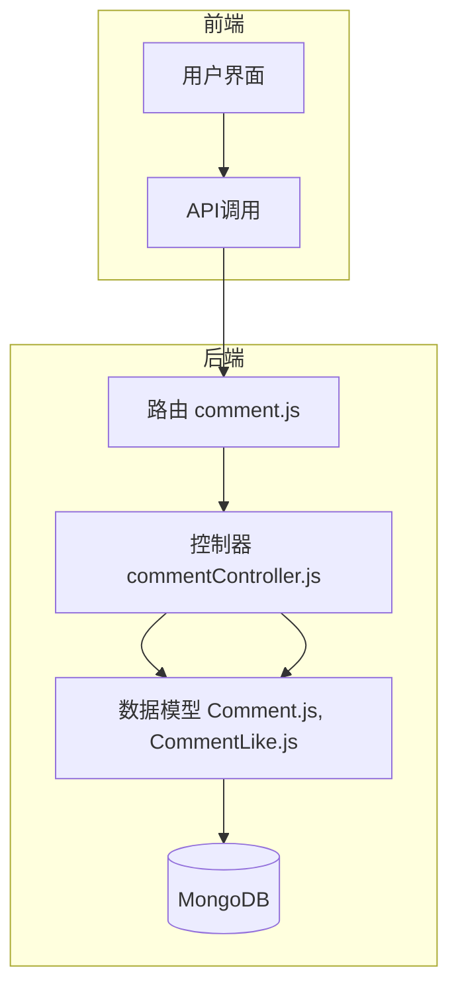
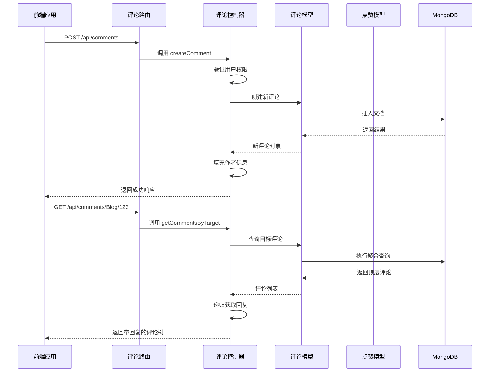
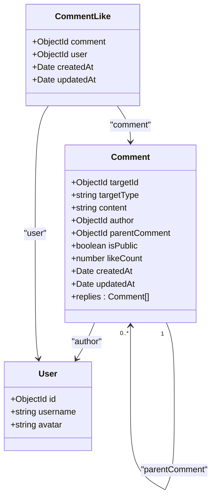
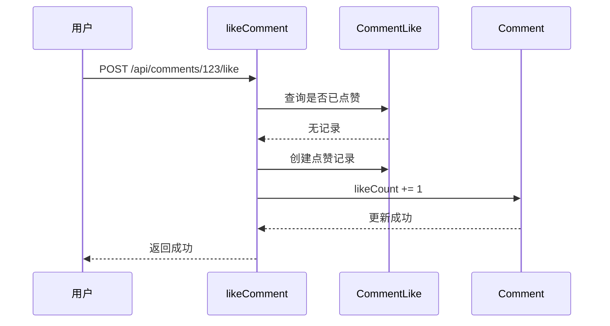
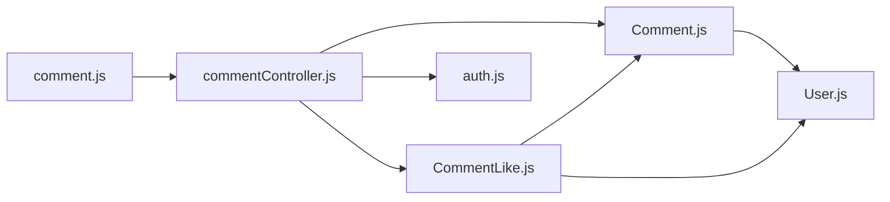

# 评论系统路由与控制器

<cite>
**本文档引用文件**  
- [comment.js](file://backend/routes/comment.js#L1-L46)
- [commentController.js](file://backend/controllers/commentController.js#L1-L467)
- [Comment.js](file://backend/models/Comment.js#L1-L82)
- [CommentLike.js](file://backend/models/CommentLike.js#L1-L31)
</cite>

## 目录
1. [简介](#简介)
2. [项目结构](#项目结构)
3. [核心组件](#核心组件)
4. [架构概览](#架构概览)
5. [详细组件分析](#详细组件分析)
6. [依赖分析](#依赖分析)
7. [性能考虑](#性能考虑)
8. [故障排查指南](#故障排查指南)
9. [结论](#结论)

## 简介
本文档深入解析基于Node.js与MongoDB构建的评论系统，涵盖其路由配置、控制器逻辑、数据模型设计及核心功能实现。重点分析多级嵌套评论的递归处理机制、权限控制策略、点赞功能联动以及性能优化方案。文档旨在为开发者提供全面的技术参考，帮助理解系统运作原理并进行有效维护与扩展。

## 项目结构
评论系统功能主要分布在后端（backend）目录下，遵循典型的MVC分层架构：
- **路由层** (`backend/routes/comment.js`)：定义所有评论相关的API端点。
- **控制器层** (`backend/controllers/commentController.js`)：处理业务逻辑，协调模型操作。
- **模型层** (`backend/models/Comment.js`, `backend/models/CommentLike.js`)：定义数据结构与数据库交互。

前端通过API调用与后端通信，相关视图组件位于`frontend/src/views/`目录下。



**图示来源**
- [comment.js](file://backend/routes/comment.js#L1-L46)
- [commentController.js](file://backend/controllers/commentController.js#L1-L467)
- [Comment.js](file://backend/models/Comment.js#L1-L82)

**本节来源**
- [comment.js](file://backend/routes/comment.js#L1-L46)
- [commentController.js](file://backend/controllers/commentController.js#L1-L467)

## 核心组件
评论系统的核心组件包括：
- **Comment 模型**：定义评论的数据结构，支持多级嵌套与目标关联。
- **CommentLike 模型**：管理用户点赞关系，防止重复点赞。
- **commentController**：实现评论的增删改查、审核、点赞等业务逻辑。
- **comment 路由**：将HTTP请求映射到对应的控制器方法。

这些组件共同协作，实现了完整的评论功能。

**本节来源**
- [commentController.js](file://backend/controllers/commentController.js#L1-L467)
- [Comment.js](file://backend/models/Comment.js#L1-L82)
- [CommentLike.js](file://backend/models/CommentLike.js#L1-L31)

## 架构概览
系统采用Express.js作为Web框架，Mongoose作为MongoDB的ODM（对象数据映射）工具。整体架构清晰，职责分离。



**图示来源**
- [comment.js](file://backend/routes/comment.js#L1-L46)
- [commentController.js](file://backend/controllers/commentController.js#L1-L467)

## 详细组件分析

### 评论数据模型分析
`Comment` 模型是整个系统的核心，其设计支持灵活的嵌套结构和权限控制。



**图示来源**
- [Comment.js](file://backend/models/Comment.js#L1-L82)
- [CommentLike.js](file://backend/models/CommentLike.js#L1-L31)

#### 关键字段说明
- **targetId & targetType**：通过 `refPath` 机制，可关联博客、图库、文档等多种资源。
- **parentComment**：引用自身，实现无限层级的评论嵌套。
- **isPublic**：控制评论的可见性，用于审核流程。
- **likeCount**：缓存点赞数，避免实时计算。
- **replies**：虚拟字段，通过 `localField` 和 `foreignField` 自动关联子评论。

#### 索引策略
- `{ targetId: 1, targetType: 1, isPublic: 1 }`：优化按目标查询评论的性能。
- `{ createdAt: -1 }`：支持按时间排序。

**本节来源**
- [Comment.js](file://backend/models/Comment.js#L1-L82)

### 评论控制器逻辑分析
控制器实现了评论系统的全部业务逻辑，核心功能包括增删改查、审核和点赞。

#### 多级嵌套评论处理
系统通过递归算法构建评论树。`getCommentsByTarget` 方法首先获取顶层评论（`parentComment: null`），然后为每个顶层评论调用 `getReplies` 函数，递归地获取其所有子评论。

```javascript
// 递归获取回复
const getReplies = async (commentId) => {
  const replies = await Comment.find({ parentComment: commentId })
  for (const reply of replies) {
    reply.replies = await getReplies(reply._id) // 递归
  }
  return replies
}
```
此方法简单有效，但可能导致“N+1查询”问题。对于深层嵌套或大量评论，建议使用MongoDB聚合管道进行优化。

**本节来源**
- [commentController.js](file://backend/controllers/commentController.js#L100-L150)

#### 用户权限控制
系统在控制器层面实施严格的权限检查：
- **创建/更新/删除**：用户必须登录，且只能操作自己的评论（管理员除外）。
- **审核**：仅管理员可通过 `moderateComment` 接口修改 `isPublic` 状态。
- **查看**：根据 `isPublic` 状态和用户角色进行过滤。未登录用户只能看到公开评论，普通用户可看到公开评论和自己的私有评论，管理员可查看所有评论。

```javascript
// 权限检查示例
const isAdmin = req.user.role === 'admin'
const isOwner = comment.author.toString() === req.user.id.toString()
if (!isAdmin && !isOwner) {
  throw new ApiError(403, '没有权限')
}
```

**本节来源**
- [commentController.js](file://backend/controllers/commentController.js#L200-L300)

#### 点赞功能实现
点赞功能通过 `CommentLike` 模型实现，确保用户对同一条评论只能点赞一次。



**图示来源**
- [commentController.js](file://backend/controllers/commentController.js#L350-L400)
- [CommentLike.js](file://backend/models/CommentLike.js#L1-L31)

`CommentLike` 模型使用复合唯一索引 `{ comment: 1, user: 1 }` 来保证数据的唯一性。

**本节来源**
- [commentController.js](file://backend/controllers/commentController.js#L350-L400)
- [CommentLike.js](file://backend/models/CommentLike.js#L1-L31)

### 路由配置分析
路由文件清晰地定义了所有API端点及其对应的中间件。

```mermaid
flowchart TD
A["GET /api/comments"] --> B[optionalAuth] --> C[getAllComments]
D["GET /api/comments/:targetType/:targetId"] --> E[optionalAuth] --> F[getCommentsByTarget]
G["POST /api/comments"] --> H[auth] --> I[createComment]
J["PUT /api/comments/:id"] --> K[auth] --> L[updateComment]
M["DELETE /api/comments/:id"] --> N[auth] --> O[deleteComment]
P["PATCH /api/comments/:id/moderate"] --> Q[auth] --> R[checkRole('admin')] --> S[moderateComment]
T["POST /api/comments/:id/like"] --> U[auth] --> V[likeComment]
W["DELETE /api/comments/:id/like"] --> X[auth] --> Y[unlikeComment]
Z["GET /api/comments/:id/like-status"] --> AA[optionalAuth] --> AB[checkLikeStatus]
```

**图示来源**
- [comment.js](file://backend/routes/comment.js#L1-L46)

**本节来源**
- [comment.js](file://backend/routes/comment.js#L1-L46)

## 依赖分析
系统内部组件依赖关系清晰：
- `commentController` 依赖 `Comment` 和 `CommentLike` 模型进行数据操作。
- `comment` 路由依赖 `commentController` 和 `auth` 中间件。
- `Comment` 模型引用 `User` 模型作为作者。

外部依赖包括：
- **Express.js**：Web服务器框架。
- **Mongoose**：MongoDB ODM。
- **bcryptjs**：密码加密（间接依赖）。



**图示来源**
- [comment.js](file://backend/routes/comment.js#L1-L46)
- [commentController.js](file://backend/controllers/commentController.js#L1-L467)
- [Comment.js](file://backend/models/Comment.js#L1-L82)
- [CommentLike.js](file://backend/models/CommentLike.js#L1-L31)

**本节来源**
- [comment.js](file://backend/routes/comment.js#L1-L46)
- [commentController.js](file://backend/controllers/commentController.js#L1-L467)

## 性能考虑
尽管系统功能完整，但仍存在一些潜在的性能问题和优化空间。

### 潜在问题
1. **深层嵌套的递归查询**：`getReplies` 函数在评论层级很深时，会产生大量数据库查询，导致性能下降。
2. **删除操作的递归开销**：删除父评论时，需要递归查找并删除所有子评论，可能成为性能瓶颈。

### 优化策略
1. **使用聚合管道**：替代递归查询，一次性构建评论树。
   ```javascript
   // 使用 $graphLookup 聚合阶段
   const pipeline = [
     { $match: { targetId: targetId, targetType: targetType, parentComment: null } },
     { $graphLookup: {
         from: "comments",
         startWith: "$_id",
         connectFromField: "_id",
         connectToField: "parentComment",
         as: "replies",
         maxDepth: 10 // 限制深度
     }}
   ];
   ```
2. **懒加载**：前端首次加载时只获取顶层评论，用户点击“展开回复”时再按需加载子评论。
3. **缓存机制**：使用Redis等缓存热门评论的完整树结构，减少数据库压力。
4. **防刷限流**：在 `createComment` 路由前添加限流中间件，防止恶意刷评论。

**本节来源**
- [commentController.js](file://backend/controllers/commentController.js#L100-L150)

## 故障排查指南
### 常见问题
1. **无法创建评论**：检查用户是否登录，`content` 字段是否为空。
2. **评论不显示**：确认 `isPublic` 是否为 `true`，或用户是否有权限查看私有评论。
3. **点赞无效**：检查 `CommentLike` 模型的唯一索引是否正常，确保用户未重复点赞。
4. **删除评论失败**：确认用户是评论作者或管理员。

### 调试建议
- 查看服务器日志中的错误信息。
- 使用Postman等工具直接测试API。
- 检查MongoDB中相关集合的数据是否正确。

**本节来源**
- [commentController.js](file://backend/controllers/commentController.js#L1-L467)
- [Comment.js](file://backend/models/Comment.js#L1-L82)

## 结论
该评论系统设计合理，功能完备，实现了多级嵌套、权限控制、点赞等核心功能。其基于Mongoose的模型设计和Express的路由配置清晰易懂。主要挑战在于深层嵌套评论的性能优化，建议采用聚合管道或懒加载策略进行改进。整体而言，这是一个可维护、可扩展的后端解决方案。