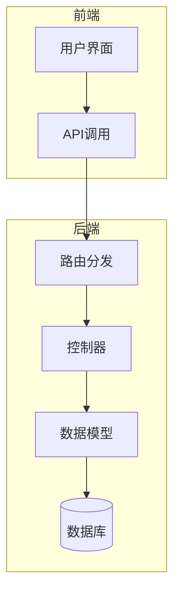
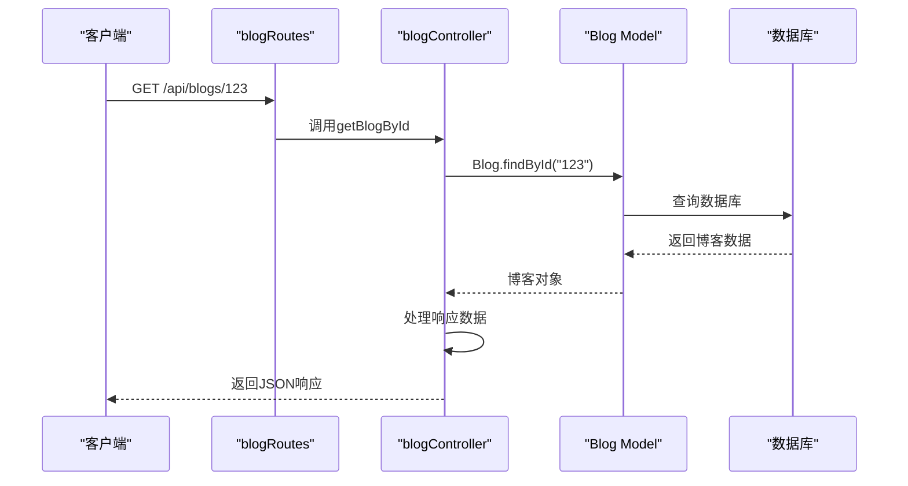

# 路由与控制器详解

<cite>
**本文档引用文件**  
- [authRoutes.js](file://backend/routes/authRoutes.js)
- [blogRoutes.js](file://backend/routes/blogRoutes.js)
- [comment.js](file://backend/routes/comment.js)
- [document.js](file://backend/routes/document.js)
- [gallery.js](file://backend/routes/gallery.js)
- [adminRoutes.js](file://backend/routes/adminRoutes.js)
- [assetRoutes.js](file://backend/routes/assetRoutes.js)
- [authController.js](file://backend/controllers/authController.js)
- [blogController.js](file://backend/controllers/blogController.js)
- [commentController.js](file://backend/controllers/commentController.js)
- [documentController.js](file://backend/controllers/documentController.js)
- [galleryController.js](file://backend/controllers/galleryController.js)
- [searchController.js](file://backend/controllers/searchController.js)
</cite>

## 目录
1. [项目结构概览](#项目结构概览)
2. [路由与控制器架构设计](#路由与控制器架构设计)
3. [核心路由模块分析](#核心路由模块分析)
4. [控制器层业务逻辑实现](#控制器层业务逻辑实现)
5. [请求处理链路解析](#请求处理链路解析)
6. [中间件组合使用模式](#中间件组合使用模式)
7. [典型请求响应示例](#典型请求响应示例)
8. [常见问题排查指南](#常见问题排查指南)

## 项目结构概览

本项目采用前后端分离架构，后端基于Node.js + Express框架构建RESTful API服务。项目主要分为`frontend`（前端）和`backend`（后端）两大模块。

后端核心目录结构如下：
- `controllers`：存放所有业务逻辑控制器
- `routes`：定义API路由规则
- `models`：Mongoose数据模型定义
- `middleware`：自定义中间件（认证、验证、上传处理等）
- `utils`：工具函数库

前端使用Vue.js框架，通过Axios调用后端API接口实现数据交互。



**图示来源**
- [app.js](file://backend/app.js)
- [index.js](file://frontend/src/main.js)

## 路由与控制器架构设计

系统采用标准的MVC架构模式，路由层负责HTTP请求的分发，控制器层处理具体业务逻辑，模型层负责数据持久化操作。

### RESTful设计实践

项目严格遵循RESTful API设计规范，主要体现在：
- 使用标准HTTP动词（GET、POST、PUT、DELETE、PATCH）
- 资源路径语义化（如`/api/blogs`、`/api/comments`）
- 状态码语义清晰（200成功、404未找到、401未授权等）
- 响应格式统一（JSON格式，包含`success`、`data`、`message`字段）

### 路由组织策略

路由文件按功能模块划分，每个模块独立维护自己的路由规则：
- `authRoutes.js`：用户认证相关
- `blogRoutes.js`：博客管理
- `comment.js`：评论系统
- `document.js`：文档库
- `gallery.js`：图库管理
- `adminRoutes.js`：管理员专用接口

```mermaid
graph TD
A[客户端请求] --> B{路由匹配}
B --> C[/api/auth/*]
B --> D[/api/blogs/*]
B --> E[/api/comments/*]
B --> F[/api/documents/*]
B --> G[/api/gallery/*]
C --> H[authController]
D --> I[blogController]
E --> J[commentController]
F --> K[documentController]
G --> L[galleryController]
```

**图示来源**
- [app.js](file://backend/app.js#L1-L50)
- [routes目录](file://backend/routes/)

## 核心路由模块分析

### 用户认证路由（authRoutes）

处理用户注册、登录及身份验证：

```javascript
// backend/routes/authRoutes.js
router.post('/register', authController.register)           // 用户注册
router.post('/login', authController.login)                 // 用户登录
router.get('/me', auth, authController.getCurrentUser)      // 获取当前用户信息
```

**权限说明**：
- `/register`、`/login`：公开接口
- `/me`：需JWT认证

**Section sources**
- [authRoutes.js](file://backend/routes/authRoutes.js#L1-L25)
- [authController.js](file://backend/controllers/authController.js#L1-L50)

### 博客管理路由（blogRoutes）

实现博客的CRUD操作及互动功能：

```javascript
// backend/routes/blogRoutes.js
// 公开接口
router.get('/', blogController.getBlogs)                    // 获取博客列表
router.get('/categories', blogController.getCategories)     // 获取分类
router.get('/:id', blogController.getBlogById)              // 获取详情

// 点赞功能
router.post('/:id/like', auth, blogController.likeBlog)     // 点赞
router.delete('/:id/like', auth, blogController.unlikeBlog) // 取消点赞

// 管理员接口
router.post('/', auth, checkRole('admin'), blogController.createBlog)    // 创建
router.put('/:id', auth, checkRole('admin'), blogController.updateBlog)  // 更新
router.delete('/:id', auth, checkRole('admin'), blogController.deleteBlog) // 删除
```

**路由顺序注意**：动态路由`/:id`必须放在具体路由之后，否则会拦截其他路由。

**Section sources**
- [blogRoutes.js](file://backend/routes/blogRoutes.js#L1-L44)
- [blogController.js](file://backend/controllers/blogController.js#L1-L100)

### 评论系统路由（comment.js）

支持嵌套评论、点赞、审核等功能：

```javascript
// backend/routes/comment.js
// 获取评论
router.get('/', optionalAuth, commentController.getAllComments)
router.get('/:targetType/:targetId', optionalAuth, commentController.getCommentsByTarget)

// 创建与管理
router.post('/', auth, commentController.createComment)
router.put('/:id', auth, commentController.updateComment)
router.delete('/:id', auth, commentController.deleteComment)

// 点赞功能
router.post('/:id/like', auth, commentController.likeComment)
router.delete('/:id/like', auth, commentController.unlikeComment)

// 管理员审核
router.patch('/:id/moderate', auth, checkRole('admin'), commentController.moderateComment)
```

**特点**：
- 支持`optionalAuth`（可选认证），未登录用户也可查看评论
- `targetType`支持多种目标（如blog、document）
- 管理员可审核评论状态

**Section sources**
- [comment.js](file://backend/routes/comment.js#L1-L45)
- [commentController.js](file://backend/controllers/commentController.js#L1-L30)

### 文档库路由（document.js）

处理文档上传、转换、访问统计等：

```javascript
// backend/routes/document.js
// 公开接口
router.get('/', optionalAuth, documentController.getDocuments)
router.get('/categories', documentController.getCategories)
router.get('/:id/preview', optionalAuth, documentController.previewDocument)
router.get('/:id/content', optionalAuth, documentController.getDocumentContent)
router.get('/:id/download', optionalAuth, documentController.downloadDocument)

// 管理员接口
router.use(auth, checkRole('admin'))
router.post('/upload', handleUploadError, documentController.uploadDocument)
router.post('/', documentController.createDocument)
router.put('/:id', documentController.updateDocument)
router.delete('/:id', documentController.deleteDocument)
```

**文件上传处理**：使用`handleUploadError`中间件捕获上传异常。

**Section sources**
- [document.js](file://backend/routes/document.js#L1-L47)
- [documentController.js](file://backend/controllers/documentController.js#L41-L84)

### 图库管理路由（gallery.js）

实现图片的上传、展示、管理功能：

```javascript
// backend/routes/gallery.js
// 公开接口
router.get('/', galleryController.getImages)
router.get('/filters', galleryController.getFilters)
router.get('/tags', galleryController.getUniqueTags)
router.get('/:id', galleryController.getImage)

// 管理员接口
router.get('/all', auth, checkRole('admin'), galleryController.getAllImages)
router.post('/', auth, checkRole('admin'), galleryController.uploadImage)
router.put('/:id', auth, checkRole('admin'), galleryController.updateImage)
router.delete('/:id', auth, checkRole('admin'), galleryController.deleteImage)
```

**权限控制**：管理员接口统一使用`checkRole('admin')`中间件。

**Section sources**
- [gallery.js](file://backend/routes/gallery.js#L1-L33)
- [galleryController.js](file://backend/controllers/galleryController.js#L35-L95)

## 控制器层业务逻辑实现

### 用户认证流程

```javascript
// authController.js
exports.register = async (req, res, next) => {
  const { username, email, password } = req.body
  // 1. 验证输入
  // 2. 检查用户是否已存在
  // 3. 密码加密（bcrypt）
  // 4. 创建用户
  // 5. 生成JWT token
  // 6. 返回用户信息和token
}
```

**安全措施**：
- 密码使用bcrypt加密存储
- JWT token设置过期时间
- 敏感信息（如密码）不在响应中返回

### 博客CRUD操作

```javascript
// blogController.js
exports.createBlog = async (req, res, next) => {
  const blogData = {
    ...req.body,
    author: req.user.username,
    authorId: req.user.id
  }
  const blog = new Blog(blogData)
  await blog.save()
  res.status(201).json({ success: true, data: blog })
}
```

**数据关联**：自动关联当前登录用户信息。

### 评论嵌套处理

系统虽未直接实现嵌套评论，但通过`targetType`和`targetId`支持多层级关联：

```javascript
// commentController.js
exports.createComment = async (req, res, next) => {
  const { targetType, targetId, content } = req.body
  const comment = new Comment({
    content,
    author: req.user.id,
    targetType,
    targetId
  })
  await comment.save()
  // 触发目标对象的评论数更新
}
```

### 文档上传与转换

```javascript
// documentController.js
exports.uploadDocument = async (req, res, next) => {
  if (!req.file) {
    throw new ApiError('未上传文件', 400)
  }
  
  // 1. 文件类型验证
  // 2. 调用documentConverter进行格式转换
  // 3. 生成缩略图
  // 4. 保存文档元数据
  // 5. 返回文档信息
}
```

**转换支持**：支持PDF、PPTX、DOCX等多种格式预览。

### 图库管理

```javascript
// galleryController.js
exports.uploadImage = catchAsync(async (req, res) => {
  // 1. 处理图片上传
  // 2. 生成缩略图
  // 3. 保存图片元数据
  // 4. 更新访问统计
  res.status(201).json({ success: true, data: image })
})
```

**性能优化**：图片访问时自动增加`viewCount`并保存。

## 请求处理链路解析

以"获取博客详情"为例，展示完整请求处理链路：



**处理步骤**：
1. 客户端发送GET请求
2. Express路由匹配`/api/blogs/:id`
3. 调用`blogController.getBlogById`方法
4. 通过Mongoose模型查询数据库
5. 返回格式化JSON响应

**图示来源**
- [blogRoutes.js](file://backend/routes/blogRoutes.js#L34-L43)
- [blogController.js](file://backend/controllers/blogController.js#L150-L180)

## 中间件组合使用模式

### JWT认证 + 角色检查

```javascript
// 需要管理员权限的路由
router.get('/all', auth, checkRole('admin'), galleryController.getAllImages)
```

**执行顺序**：
1. `auth`中间件：验证JWT token，解析用户信息
2. `checkRole('admin')`：检查用户角色是否为admin
3. 执行控制器方法

### 认证 + 输入验证

```javascript
// 结合验证中间件
router.post('/', auth, validation.blog, blogController.createBlog)
```

**validation.blog**：自定义验证规则，确保输入数据合法性。

### 文件上传错误处理

```javascript
router.post('/upload', handleUploadError, documentController.uploadDocument)
```

**handleUploadError**：捕获文件上传过程中的Multer错误，转换为统一API错误响应。

## 典型请求响应示例

### 用户登录请求

**请求**：
```http
POST /api/auth/login
Content-Type: application/json

{
  "email": "user@example.com",
  "password": "123456"
}
```

**成功响应**：
```json
{
  "success": true,
  "data": {
    "token": "eyJhbGciOiJIUzI1NiIs...",
    "user": {
      "id": "60d5ecf9f1a2c34567890123",
      "username": "testuser",
      "email": "user@example.com",
      "role": "user"
    }
  }
}
```

### 获取博客列表

**请求**：
```http
GET /api/blogs?page=1&pageSize=10&category=技术
```

**响应**：
```json
{
  "success": true,
  "data": {
    "blogs": [...],
    "pagination": {
      "current": 1,
      "pageSize": 10,
      "total": 25,
      "pages": 3
    }
  }
}
```

## 常见问题排查指南

### 路由冲突

**问题现象**：某些路由无法访问或返回错误数据。

**解决方案**：
1. 检查路由定义顺序，确保动态路由`/:id`在具体路由之后
2. 验证路由路径是否重复定义
3. 使用`console.log`调试路由匹配过程

### 异步错误捕获

**问题现象**：异步操作中的错误未被正确处理，导致进程崩溃。

**解决方案**：
1. 使用`try-catch`包裹异步操作
2. 或使用`catchAsync`包装函数统一处理
3. 确保所有错误都传递给`next()`中间件

```javascript
exports.getImages = catchAsync(async (req, res) => {
  // 异步操作
})
```

### 参数解析异常

**问题现象**：`req.params`或`req.query`获取不到预期值。

**解决方案**：
1. 检查URL编码问题，使用`decodeURIComponent`
2. 验证参数类型，如ObjectId有效性
3. 添加参数验证中间件

```javascript
if (!mongoose.Types.ObjectId.isValid(blogId)) {
  return res.status(400).json({ message: '无效的blogId' })
}
```

### 认证失败

**问题现象**：已登录用户访问受保护路由返回401。

**排查步骤**：
1. 检查请求头是否包含`Authorization: Bearer <token>`
2. 验证JWT token是否过期
3. 检查`auth`中间件是否正确解析token
4. 确认用户角色是否满足`checkRole`要求