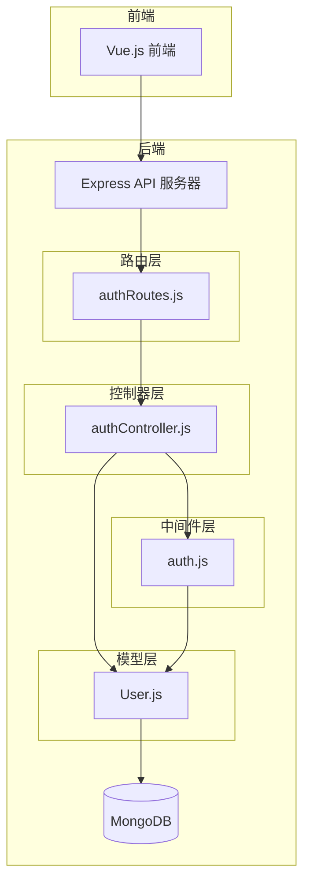
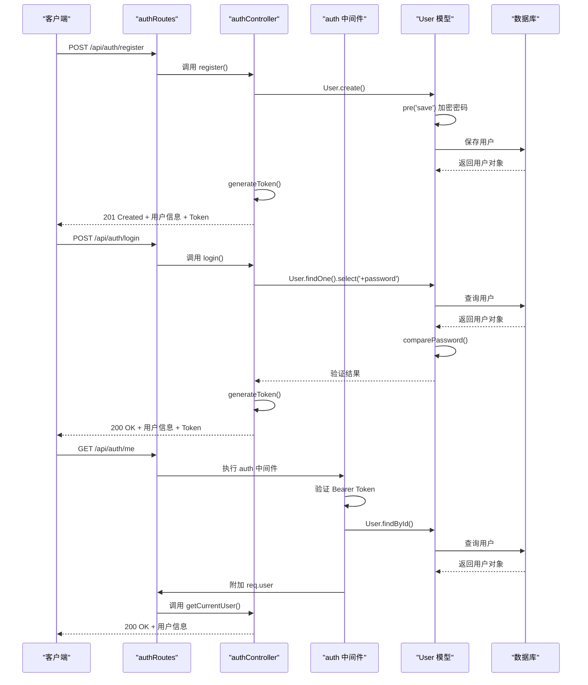
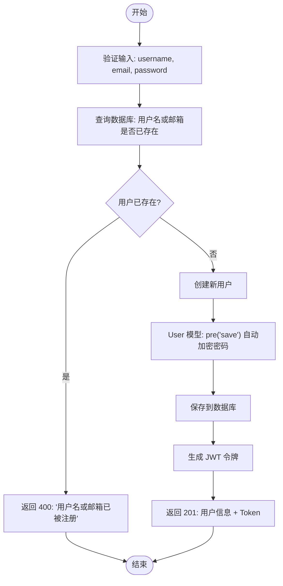
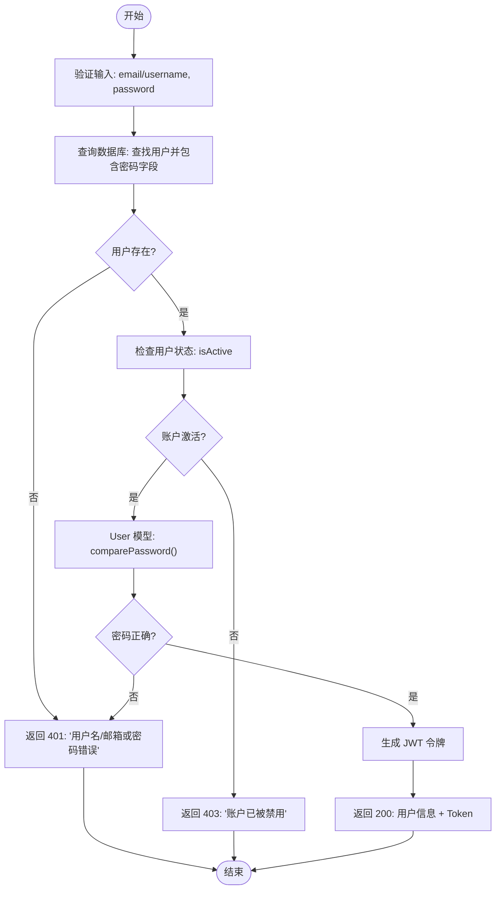
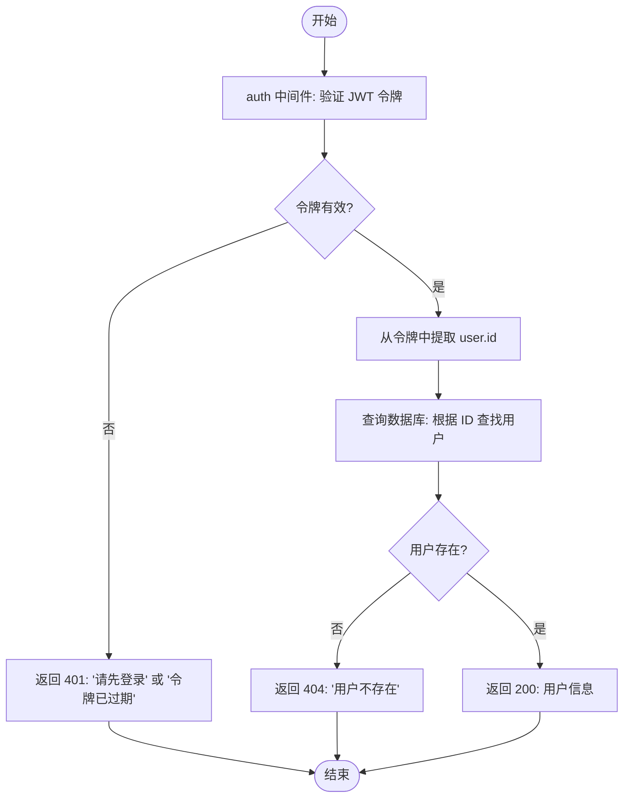
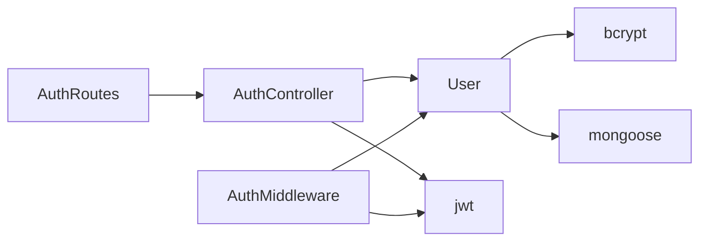

# 身份认证路由与控制器

<cite>
**本文档引用的文件**  
- [authRoutes.js](file://backend/routes/authRoutes.js)
- [authController.js](file://backend/controllers/authController.js)
- [auth.js](file://backend/middleware/auth.js)
- [User.js](file://backend/models/User.js)
</cite>

## 目录
1. [简介](#简介)
2. [项目结构](#项目结构)
3. [核心组件](#核心组件)
4. [架构概览](#架构概览)
5. [详细组件分析](#详细组件分析)
6. [依赖关系分析](#依赖关系分析)
7. [性能考虑](#性能考虑)
8. [故障排查指南](#故障排查指南)
9. [结论](#结论)

## 简介
本文件深入解析 `my_website` 项目的身份认证模块实现。重点分析 `authRoutes.js` 中定义的注册、登录、获取用户信息等 API 路由如何映射到 `authController.js` 中的具体处理函数，阐述 JWT 令牌生成、验证及用户会话管理的完整流程。结合代码实例展示请求处理链路：从 HTTP 请求进入路由层，经过中间件预处理（如输入验证），最终由控制器调用 `User` 模型完成业务逻辑的全过程。解释密码加密（bcrypt）、令牌签发（JWT）、登录状态校验等关键安全机制的实现方式。提供典型请求/响应示例，并说明错误处理策略（如 401 未授权、400 参数错误）。针对常见问题如令牌过期处理、CORS 跨域限制等提供解决方案和调试建议。

## 项目结构
`my_website` 是一个前后端分离的 Web 应用，后端采用 Node.js + Express + MongoDB 技术栈。身份认证相关的核心逻辑位于 `backend` 目录下，遵循典型的 MVC（模型-视图-控制器）分层架构。



**图示来源**
- [authRoutes.js](file://backend/routes/authRoutes.js)
- [authController.js](file://backend/controllers/authController.js)
- [auth.js](file://backend/middleware/auth.js)
- [User.js](file://backend/models/User.js)

**本节来源**
- [authRoutes.js](file://backend/routes/authRoutes.js)
- [authController.js](file://backend/controllers/authController.js)
- [auth.js](file://backend/middleware/auth.js)
- [User.js](file://backend/models/User.js)

## 核心组件
身份认证模块的核心组件包括：
- **路由 (authRoutes.js)**：定义 API 端点，将 HTTP 请求映射到控制器函数。
- **控制器 (authController.js)**：处理业务逻辑，协调模型和中间件。
- **中间件 (auth.js)**：在请求处理链中执行认证和授权检查。
- **模型 (User.js)**：定义用户数据结构，封装数据访问和密码加密逻辑。

这些组件共同协作，实现了安全的用户注册、登录和信息获取功能。

**本节来源**
- [authRoutes.js](file://backend/routes/authRoutes.js#L1-L25)
- [authController.js](file://backend/controllers/authController.js#L1-L141)
- [auth.js](file://backend/middleware/auth.js#L1-L66)
- [User.js](file://backend/models/User.js#L1-L89)

## 架构概览
身份认证模块的架构遵循清晰的分层模式，确保了关注点分离和代码可维护性。



**图示来源**
- [authRoutes.js](file://backend/routes/authRoutes.js)
- [authController.js](file://backend/controllers/authController.js)
- [auth.js](file://backend/middleware/auth.js)
- [User.js](file://backend/models/User.js)

## 详细组件分析
### 路由层分析 (authRoutes.js)
`authRoutes.js` 文件定义了身份认证相关的 API 端点，是客户端请求进入后端系统的入口。

```javascript
// 注册新用户
router.post('/register', authController.register)

// 用户登录
router.post('/login', authController.login)

// 获取当前用户信息（需要认证）
router.get('/me', auth, authController.getCurrentUser)
```

- **POST /register**: 将请求直接交给 `authController.register` 函数处理。
- **POST /login**: 将请求直接交给 `authController.login` 函数处理。
- **GET /me**: 这是一个受保护的路由。它首先执行 `auth` 中间件进行身份验证，只有验证通过后，才会将请求传递给 `authController.getCurrentUser` 函数。

**本节来源**
- [authRoutes.js](file://backend/routes/authRoutes.js#L1-L25)

### 控制器层分析 (authController.js)
`authController.js` 是业务逻辑的核心，包含 `register`、`login` 和 `getCurrentUser` 三个主要函数。

#### 注册流程 (register)


**图示来源**
- [authController.js](file://backend/controllers/authController.js#L25-L58)
- [User.js](file://backend/models/User.js#L60-L70)

#### 登录流程 (login)


**图示来源**
- [authController.js](file://backend/controllers/authController.js#L60-L110)
- [User.js](file://backend/models/User.js#L73-L78)

#### 获取用户信息流程 (getCurrentUser)


**图示来源**
- [authController.js](file://backend/controllers/authController.js#L112-L138)
- [auth.js](file://backend/middleware/auth.js#L1-L25)

### 中间件层分析 (auth.js)
`auth.js` 提供了 `auth` 中间件，用于保护需要身份验证的路由。

```javascript
exports.auth = async (req, res, next) => {
  try {
    const authHeader = req.headers.authorization
    if (!authHeader || !authHeader.startsWith('Bearer ')) {
      throw new ApiError(401, '请先登录')
    }
    const token = authHeader.split(' ')[1]
    const decoded = jwt.verify(token, process.env.JWT_SECRET)
    req.user = decoded // 将用户信息附加到请求对象
    next()
  } catch (error) {
    // 处理令牌无效或过期的错误
    next(new ApiError(401, '无效的令牌' 或 '令牌已过期'))
  }
}
```

该中间件从 `Authorization` 请求头中提取 `Bearer` 令牌，使用 `JWT_SECRET` 密钥进行验证。验证成功后，将解码出的用户信息（包含 `id` 和 `role`）存入 `req.user`，供后续的控制器函数使用。

**本节来源**
- [auth.js](file://backend/middleware/auth.js#L1-L25)

### 模型层分析 (User.js)
`User.js` 定义了用户数据模型，是数据持久化的基础。

```mermaid
classDiagram
class User {
+String username
+String email
-String password
+String avatar
+String role
+Boolean isActive
+Date createdAt
+Date updatedAt
+comparePassword(candidatePassword) Boolean
}
User : pre('save') 加密密码
User : unique 索引 : username, email
User : match 验证 : email
User : minlength 验证 : password
```

**图示来源**
- [User.js](file://backend/models/User.js#L1-L89)

关键特性：
- **数据验证**：对 `username`、`email`、`password` 等字段设置了必填、唯一性、格式和长度等验证规则。
- **密码安全**：通过 `pre('save')` 钩子，在用户数据保存到数据库前自动使用 `bcrypt` 加密密码。`select: false` 确保密码字段在常规查询中不会被返回。
- **方法**：`comparePassword` 方法用于验证用户输入的密码是否与数据库中存储的加密密码匹配。

**本节来源**
- [User.js](file://backend/models/User.js#L1-L89)

## 依赖关系分析
身份认证模块各组件之间的依赖关系清晰，形成了一个单向的依赖链。



- `authRoutes` 依赖 `authController` 和 `auth` 中间件。
- `authController` 和 `auth` 中间件都依赖 `User` 模型来访问用户数据。
- `User` 模型依赖 `bcrypt` 进行密码加密，依赖 `mongoose` 进行数据库操作。
- `authController` 和 `auth` 中间件都依赖 `jsonwebtoken` (jwt) 库来生成和验证 JWT 令牌。

这种依赖关系避免了循环依赖，保证了模块的独立性和可测试性。

**图示来源**
- [authRoutes.js](file://backend/routes/authRoutes.js)
- [authController.js](file://backend/controllers/authController.js)
- [auth.js](file://backend/middleware/auth.js)
- [User.js](file://backend/models/User.js)

**本节来源**
- [authRoutes.js](file://backend/routes/authRoutes.js)
- [authController.js](file://backend/controllers/authController.js)
- [auth.js](file://backend/middleware/auth.js)
- [User.js](file://backend/models/User.js)

## 性能考虑
- **密码加密**：`bcrypt` 是一个计算密集型的哈希算法，`saltRounds` 设置为 10，提供了良好的安全性和性能平衡。在高并发场景下，应监控其对 CPU 的影响。
- **数据库查询**：`username` 和 `email` 字段上的唯一索引确保了查找操作的高效性。`getCurrentUser` 使用 `_id` 查询，这是最快的查询方式。
- **JWT 令牌**：JWT 是无状态的，服务器无需在内存或数据库中存储会话信息，减轻了服务器负担，有利于水平扩展。但需要妥善管理令牌的过期时间。

## 故障排查指南
- **400 Bad Request**：检查请求体是否包含必需的 `username`、`email`、`password` 字段，以及字段格式是否符合要求（如邮箱格式）。
- **401 Unauthorized**：
  - `请先登录`：检查请求头 `Authorization` 是否存在且格式为 `Bearer <token>`。
  - `无效的令牌`：检查 `JWT_SECRET` 环境变量是否正确，或客户端发送的令牌是否损坏。
  - `令牌已过期`：客户端需要重新登录以获取新令牌。
- **403 Forbidden**：检查用户 `role` 是否符合 `checkRole` 中间件的要求，或用户账户是否被禁用 (`isActive: false`)。
- **500 Internal Server Error**：检查数据库连接是否正常，环境变量（如 `JWT_SECRET`）是否已正确配置。

**本节来源**
- [authController.js](file://backend/controllers/authController.js)
- [auth.js](file://backend/middleware/auth.js)
- [User.js](file://backend/models/User.js)

## 结论
`my_website` 的身份认证模块设计良好，实现了安全、高效的用户管理功能。通过 Express 路由、控制器、中间件和 Mongoose 模型的分层协作，清晰地分离了关注点。使用 JWT 进行无状态会话管理，结合 `bcrypt` 对密码进行强加密，确保了系统的安全性。该模块具备良好的可维护性和扩展性，为整个应用提供了可靠的用户认证基础。