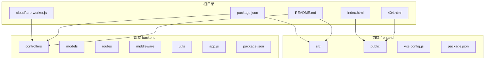
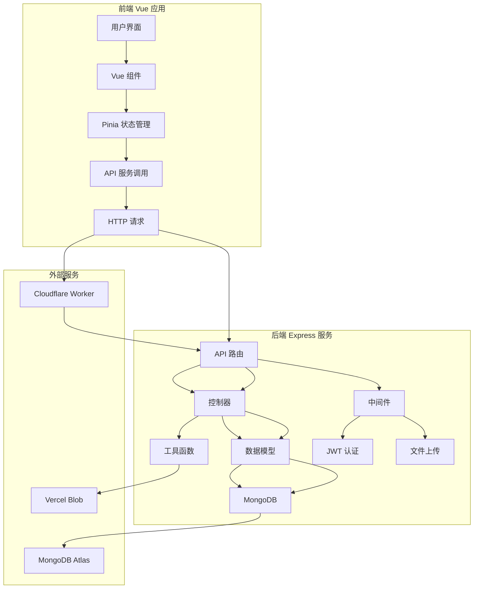

# 项目目录结构详解

<cite>
**本文档引用文件**  
- [app.js](file://backend/app.js)
- [authController.js](file://backend/controllers/authController.js)
- [blogController.js](file://backend/controllers/blogController.js)
- [commentController.js](file://backend/controllers/commentController.js)
- [documentController.js](file://backend/controllers/documentController.js)
- [friendLinkController.js](file://backend/controllers/friendLinkController.js)
- [galleryController.js](file://backend/controllers/galleryController.js)
- [searchController.js](file://backend/controllers/searchController.js)
- [authRoutes.js](file://backend/routes/authRoutes.js)
- [blog.js](file://backend/routes/blog.js)
- [comment.js](file://backend/routes/comment.js)
- [document.js](file://backend/routes/document.js)
- [friendLink.js](file://backend/routes/friendLink.js)
- [gallery.js](file://backend/routes/gallery.js)
- [searchRoutes.js](file://backend/routes/searchRoutes.js)
- [adminRoutes.js](file://backend/routes/adminRoutes.js)
- [userRoutes.js](file://backend/routes/userRoutes.js)
- [assetRoutes.js](file://backend/routes/assetRoutes.js)
- [auth.js](file://backend/middleware/auth.js)
- [validation.js](file://backend/middleware/validation.js)
- [upload.js](file://backend/middleware/upload.js)
- [Blog.js](file://backend/models/Blog.js)
- [Comment.js](file://backend/models/Comment.js)
- [Document.js](file://backend/models/Document.js)
- [FriendLink.js](file://backend/models/FriendLink.js)
- [Gallery.js](file://backend/models/Gallery.js)
- [User.js](file://backend/models/User.js)
- [Visit.js](file://backend/models/Visit.js)
- [main.js](file://frontend/src/main.js)
- [App.vue](file://frontend/src/App.vue)
- [router/index.js](file://frontend/src/router/index.js)
- [store/index.js](file://frontend/src/store/index.js)
- [api/index.ts](file://frontend/src/api/index.ts)
- [services/api.ts](file://frontend/src/services/api.ts)
- [components/Header.vue](file://frontend/src/components/Header.vue)
- [components/Footer.vue](file://frontend/src/components/Footer.vue)
- [views/Home.vue](file://frontend/src/views/Home.vue)
- [views/Blog.vue](file://frontend/src/views/Blog.vue)
- [views/BlogDetail.vue](file://frontend/src/views/BlogDetail.vue)
- [views/DocumentLibrary.vue](file://frontend/src/views/DocumentLibrary.vue)
- [views/Gallery.vue](file://frontend/src/views/Gallery.vue)
- [views/Comments.vue](file://frontend/src/views/Comments.vue)
- [views/Admin/AdminPanel.vue](file://frontend/src/views/Admin/AdminPanel.vue)
- [views/User/UserPanel.vue](file://frontend/src/views/User/UserPanel.vue)
- [README.md](file://README.md)
</cite>

## 目录

1. [项目结构总览](#项目结构总览)  
2. [前端源码结构解析](#前端源码结构解析)  
   2.1 [components 组件目录](#components-组件目录)  
   2.2 [views 视图页面](#views-视图页面)  
   2.3 [router 路由管理](#router-路由管理)  
   2.4 [store 状态管理](#store-状态管理)  
   2.5 [api 接口服务](#api-接口服务)  
3. [后端服务架构分析](#后端服务架构分析)  
   3.1 [controllers 控制器层](#controllers-控制器层)  
   3.2 [models 数据模型](#models-数据模型)  
   3.3 [routes 路由定义](#routes-路由定义)  
   3.4 [middleware 中间件系统](#middleware-中间件系统)  
   3.5 [utils 工具函数](#utils-工具函数)  
4. [构建输出与资源处理](#构建输出与资源处理)  
   4.1 [assets 构建产物](#assets-构建产物)  
   4.2 [public 与 static 资源差异](#public-与-static-资源差异)  
5. [开发构建与部署流程](#开发构建与部署流程)  
6. [系统架构图示](#系统架构图示)  
7. [总结](#总结)

## 项目结构总览

本项目采用典型的前后端分离架构，整体目录清晰划分三大核心区域：根目录、前端（frontend）和后端（backend）。项目基于现代化技术栈构建，前端使用 Vue 3 + Vite，后端使用 Node.js + Express，数据库为 MongoDB，部署平台为 Vercel。

**图示来源**  
- [README.md](file://README.md)

## 前端源码结构解析

前端代码位于 `frontend/src` 目录下，采用模块化设计，职责分明，便于维护和扩展。

### components 组件目录

`components` 目录存放可复用的UI组件，按功能组织。主要组件包括：

- **基础布局组件**：`Header.vue`、`Footer.vue`、`Sidebar.vue`、`MainLayout.vue`、`UserLayout.vue`
- **功能组件**：`LoginModal.vue`、`ParticlesBackground.vue`、`Navigation.vue`
- **内容组件**：`CommentNode.vue`、`PdfViewer.vue`、`VueOfficeViewer.vue`、`PptxViewer.vue`
- **文档预览模块**：`document-preview` 子目录专门处理多种格式文档的在线预览

这些组件通过 props 和 emits 实现父子通信，结合 Pinia 状态管理实现跨组件数据共享。

**本节来源**  
- [components/Header.vue](file://frontend/src/components/Header.vue)
- [components/Footer.vue](file://frontend/src/components/Footer.vue)
- [components/CommentNode.vue](file://frontend/src/components/CommentNode.vue)
- [components/PdfViewer.vue](file://frontend/src/components/PdfViewer.vue)

### views 视图页面

`views` 目录存放页面级组件，每个文件对应一个路由页面。主要页面包括：

- **主页**：`Home.vue`
- **博客相关**：`Blog.vue`（列表）、`BlogDetail.vue`（详情）
- **文档库**：`DocumentLibrary.vue`
- **图库**：`Gallery.vue`
- **评论页**：`Comments.vue`
- **用户与管理员面板**：`User/UserPanel.vue`、`Admin/AdminPanel.vue`
- **其他页面**：`About.vue`、`FriendLinks.vue`、`SearchView.vue`、`NotFound.vue`

页面组件通常会引入多个 `components` 中的子组件，并通过 `api` 模块调用后端接口获取数据。

**本节来源**  
- [views/Home.vue](file://frontend/src/views/Home.vue)
- [views/Blog.vue](file://frontend/src/views/Blog.vue)
- [views/BlogDetail.vue](file://frontend/src/views/BlogDetail.vue)
- [views/DocumentLibrary.vue](file://frontend/src/views/DocumentLibrary.vue)
- [views/Gallery.vue](file://frontend/src/views/Gallery.vue)
- [views/Comments.vue](file://frontend/src/views/Comments.vue)
- [views/Admin/AdminPanel.vue](file://frontend/src/views/Admin/AdminPanel.vue)
- [views/User/UserPanel.vue](file://frontend/src/views/User/UserPanel.vue)

### router 路由管理

`router/index.js` 定义了前端应用的路由规则，使用 Vue Router 实现单页应用（SPA）的导航。路由配置包括：

- 静态路由：如 `/`、`/blog`、`/gallery` 等
- 动态路由：如 `/blog/:id` 用于博客详情页
- 嵌套路由：管理员面板和用户面板采用嵌套路由组织子功能模块
- 路由守卫：集成权限控制，未登录用户无法访问管理页面

路由与 `views` 目录中的组件一一对应，实现 URL 到页面的映射。

**本节来源**  
- [router/index.js](file://frontend/src/router/index.js)

### store 状态管理

`store` 目录使用 Pinia 进行全局状态管理，替代传统的 Vuex。结构如下：

- `index.js`：根 store 入口
- `modules/`：模块化状态管理
  - `auth.js`：用户认证状态（token、用户信息、登录状态）
  - `blog.js`：博客相关状态（分类、标签、文章列表缓存）

通过模块化设计，将不同业务领域的状态分离，避免状态混乱，提升可维护性。

**本节来源**  
- [store/index.js](file://frontend/src/store/index.js)
- [store/modules/auth.js](file://frontend/src/store/modules/auth.js)
- [store/modules/blog.js](file://frontend/src/store/modules/blog.js)

### api 接口服务

`api` 目录封装了所有与后端的 HTTP 通信，基于 Axios 实现。主要特点：

- 按功能拆分：`auth.ts`、`blog.ts`、`comment.ts` 等，每个文件对应一个业务模块
- 统一入口：`index.ts` 导出所有 API 方法，便于集中管理
- 请求拦截：在 `services/api.ts` 中配置基础 URL、超时时间、请求头（如 Authorization）
- 响应处理：统一处理错误码、成功/失败提示

前端组件通过调用这些 API 方法与后端交互，实现数据的增删改查。

**本节来源**  
- [api/index.ts](file://frontend/src/api/index.ts)
- [services/api.ts](file://frontend/src/services/api.ts)

## 后端服务架构分析

后端采用经典的 MVC（Model-View-Controller）架构模式，结合 Express 框架实现 RESTful API。

### controllers 控制器层

`controllers` 目录存放业务逻辑处理函数，每个控制器文件对应一个资源类型：

- `authController.js`：用户注册、登录、JWT 认证
- `blogController.js`：博客文章的增删改查
- `commentController.js`：评论的提交、回复、审核
- `documentController.js`：文档的上传、分类、预览
- `friendLinkController.js`：友情链接的申请与管理
- `galleryController.js`：图片的上传与展示
- `searchController.js`：全文搜索功能

控制器接收路由传来的请求，调用模型层操作数据库，并返回 JSON 响应。

**本节来源**  
- [controllers/authController.js](file://backend/controllers/authController.js)
- [controllers/blogController.js](file://backend/controllers/blogController.js)
- [controllers/commentController.js](file://backend/controllers/commentController.js)
- [controllers/documentController.js](file://backend/controllers/documentController.js)
- [controllers/friendLinkController.js](file://backend/controllers/friendLinkController.js)
- [controllers/galleryController.js](file://backend/controllers/galleryController.js)
- [controllers/searchController.js](file://backend/controllers/searchController.js)

### models 数据模型

`models` 目录定义 MongoDB 数据库的 Schema 模型，使用 Mongoose 实现：

- `Blog.js`：博客文章（标题、内容、分类、标签、作者、发布时间）
- `Comment.js`：评论（内容、用户、目标文章、父评论、审核状态）
- `Document.js`：文档（文件名、路径、类型、分类、上传者）
- `FriendLink.js`：友情链接（网站名、URL、图标、描述、状态）
- `Gallery.js`：图库图片（文件名、路径、分类、标签）
- `User.js`：用户信息（用户名、邮箱、密码哈希、角色）
- `Visit.js`：访问统计

每个模型定义了字段类型、验证规则和索引，确保数据一致性。

**本节来源**  
- [models/Blog.js](file://backend/models/Blog.js)
- [models/Comment.js](file://backend/models/Comment.js)
- [models/Document.js](file://backend/models/Document.js)
- [models/FriendLink.js](file://backend/models/FriendLink.js)
- [models/Gallery.js](file://backend/models/Gallery.js)
- [models/User.js](file://backend/models/User.js)
- [models/Visit.js](file://backend/models/Visit.js)

### routes 路由定义

`routes` 目录定义 API 端点，将 HTTP 请求映射到对应的控制器方法：

- `authRoutes.js`：`/api/auth/register`, `/api/auth/login`
- `blog.js`：`/api/blog`, `/api/blog/:id`
- `comment.js`：`/api/comment`, `/api/comment/:id`
- `document.js`：`/api/document`
- `friendLink.js`：`/api/friendlink`
- `gallery.js`：`/api/gallery`
- `searchRoutes.js`：`/api/search`
- `adminRoutes.js`：管理员专用接口
- `userRoutes.js`：用户个人信息接口

路由文件在 `app.js` 中被统一引入和挂载。

**本节来源**  
- [routes/authRoutes.js](file://backend/routes/authRoutes.js)
- [routes/blog.js](file://backend/routes/blog.js)
- [routes/comment.js](file://backend/routes/comment.js)
- [routes/document.js](file://backend/routes/document.js)
- [routes/friendLink.js](file://backend/routes/friendLink.js)
- [routes/gallery.js](file://backend/routes/gallery.js)
- [routes/searchRoutes.js](file://backend/routes/searchRoutes.js)
- [routes/adminRoutes.js](file://backend/routes/adminRoutes.js)
- [routes/userRoutes.js](file://backend/routes/userRoutes.js)

### middleware 中间件系统

`middleware` 目录存放 Express 中间件，用于处理通用逻辑：

- `auth.js`：JWT 认证中间件，验证请求头中的 token
- `validation.js`：参数校验中间件，确保输入数据合法
- `upload.js`：文件上传中间件，使用 Multer 处理 multipart/form-data

中间件在路由处理前执行，实现权限控制、数据验证和文件处理。

**本节来源**  
- [middleware/auth.js](file://backend/middleware/auth.js)
- [middleware/validation.js](file://backend/middleware/validation.js)
- [middleware/upload.js](file://backend/middleware/upload.js)

### utils 工具函数

`utils` 目录存放通用工具函数：

- `documentConverter.js`：文档格式转换（如 DOCX 转 PDF）
- `error.js`：统一错误处理
- `favicon.js`：Favicon 处理
- `fileUpload.js`：文件上传逻辑封装
- `uploader.js`：集成 Vercel Blob 的上传服务

这些工具函数被控制器或中间件调用，提高代码复用性。

**本节来源**  
- [utils/documentConverter.js](file://backend/utils/documentConverter.js)
- [utils/error.js](file://backend/utils/error.js)
- [utils/fileUpload.js](file://backend/utils/fileUpload.js)
- [utils/uploader.js](file://backend/utils/uploader.js)

## 构建输出与资源处理

### assets 构建产物

`assets` 目录是前端构建（`npm run build`）的输出目录，包含：

- JavaScript 文件：如 `admin-QLSWJlTk.js`、`blog-BpxYLf10.js`，已分块打包
- CSS 文件：如 `CommentNode-DrpGNQ78.css`、`NotFound-XJcwFHFr.css`
- 静态资源：图片、字体等（如有）

这些文件由 Vite 自动生成，包含内容哈希，用于浏览器缓存优化。

**本节来源**  
- [assets/CommentNode-DrpGNQ78.css](file://assets/CommentNode-DrpGNQ78.css)
- [assets/blog-BpxYLf10.js](file://assets/blog-BpxYLf10.js)

### public 与 static 资源差异

- `frontend/public`：存放静态资源，构建时原样复制到输出目录。如 `index.html`、`404.html`、`pdf.worker.min.mjs`。这些文件通过绝对路径访问（如 `/pdf.worker.min.mjs`）。
- `frontend/src/assets`：存放源码级静态资源（如 `main.css`），在构建时会被 Vite 处理（压缩、哈希化），并作为模块导入。

区别在于 `public` 是“原样复制”，而 `src/assets` 是“构建处理”。

**本节来源**  
- [frontend/public/index.html](file://frontend/public/index.html)
- [frontend/public/pdf.worker.min.mjs](file://frontend/public/pdf.worker.min.mjs)
- [frontend/src/assets/main.css](file://frontend/src/assets/main.css)

## 开发构建与部署流程

1. **开发环境启动**：
   - 前端：`npm run dev` → Vite 启动开发服务器（默认端口 5173）
   - 后端：`npm run dev:server` → nodemon 启动 Express 服务（默认端口 3000）

2. **构建流程**：
   - 前端执行 `npm run build`，Vite 将 `frontend/src` 编译输出到 `dist` 目录（此处映射为 `assets`）
   - 后端无需构建，直接部署源码

3. **部署结构**：
   - 前端：部署 `dist` 目录到 GitHub Pages 或 Vercel Static Hosting
   - 后端：部署 `backend` 目录到 Vercel Serverless Functions
   - 数据库：使用 MongoDB Atlas 云服务
   - 文件存储：使用 Vercel Blob 存储上传的文档和图片

4. **API 代理**：通过 `cloudflare-worker.js` 实现 API 请求代理，提升中国大陆访问稳定性。

**本节来源**  
- [README.md](file://README.md)
- [vite.config.js](file://frontend/vite.config.js)
- [app.js](file://backend/app.js)
- [cloudflare-worker.js](file://cloudflare-worker.js)

## 系统架构图示

**图示来源**  
- [app.js](file://backend/app.js)
- [router/index.js](file://frontend/src/router/index.js)
- [api/index.ts](file://frontend/src/api/index.ts)
- [controllers/*.js](file://backend/controllers/)
- [models/*.js](file://backend/models/)

## 总结

本项目结构清晰，前后端职责分明，采用现代化技术栈和工程化实践。前端通过组件化和状态管理实现高效开发，后端遵循 MVC 模式保证代码可维护性。构建流程自动化，部署方案灵活，支持 Serverless 架构。新开发者可通过本文档快速理解项目布局，定位关键代码，高效参与开发。